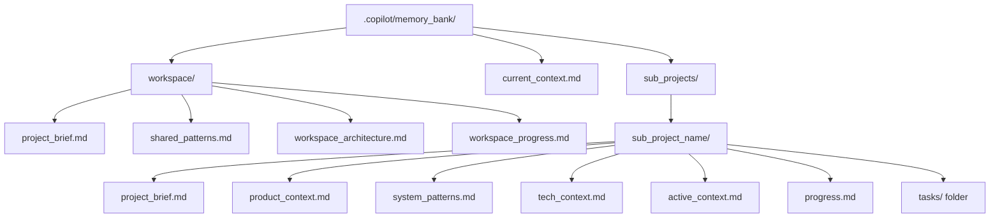
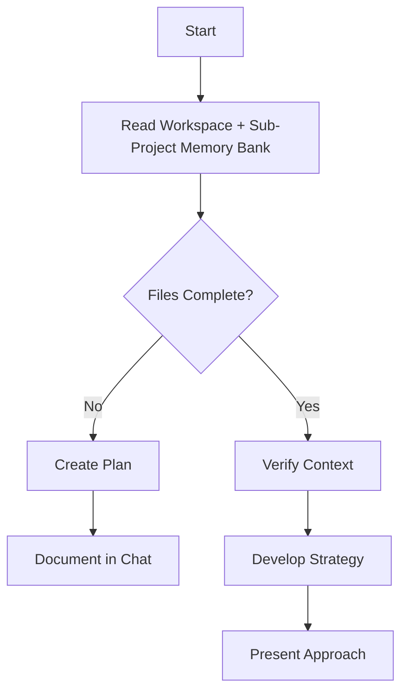
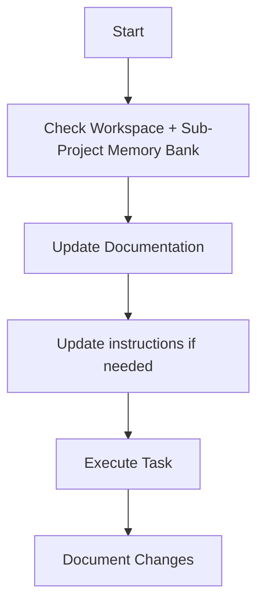
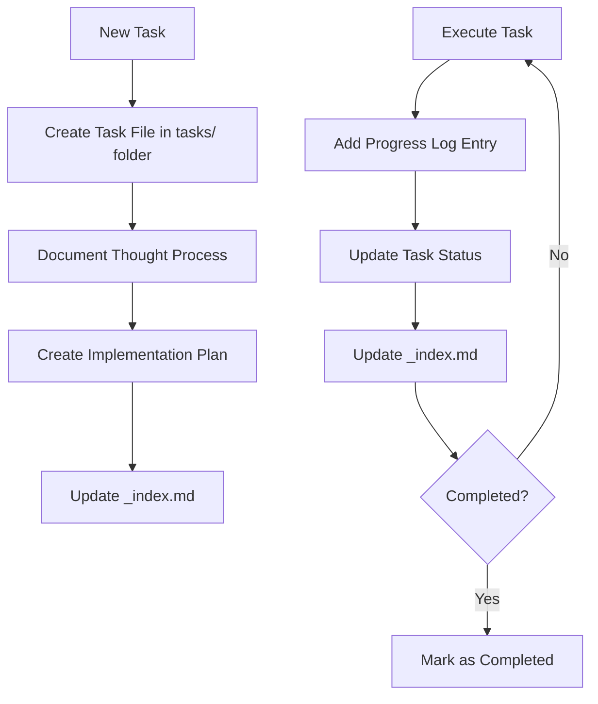
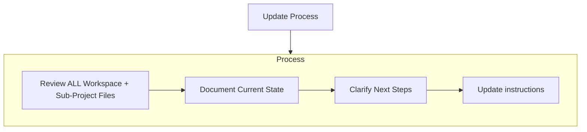
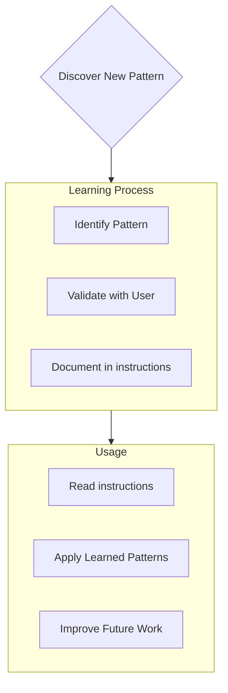

Coding standards, domain knowledge, and preferences that AI should follow.


# Multi-Project Memory Bank (Workspace & Context-Aware Edition)

You are an expert software engineer whose memory resets between sessions. You rely ENTIRELY on the Multi-Project Memory Bank to understand and continue work. You MUST read ALL workspace-level files, root context, and memory bank files for the active sub-project at the start of EVERY task.

## Multi-Project Memory Bank Structure

The Memory Bank supports multiple sub-projects and workspace-level shared files. All files use `snake_case` naming. A root-level `current_context.md` file tracks the active sub-project for context switching.




### Workspace-Level Files (Inherited by All Sub-Projects)
- `workspace/project_brief.md`: Workspace vision, objectives, architecture, and standards
- `workspace/shared_patterns.md`: Core implementation, architecture, and methodology patterns
- `workspace/workspace_architecture.md`: High-level workspace structure and relationships
- `workspace/workspace_progress.md`: Cross-crate milestones, status, and strategic decisions

### Root-Level Context File
- `current_context.md`: Tracks the currently active sub-project for context switching

### Core Files (Required per sub-project)
1. `project_brief.md`
   - Foundation document for the sub-project
   - Defines requirements, goals, and scope

2. `product_context.md`
   - Why this sub-project exists
   - Problems it solves
   - User experience goals

3. `active_context.md`
   - Current work focus
   - Recent changes
   - Next steps

4. `system_patterns.md`
   - System architecture
   - Key technical decisions
   - Design patterns in use

5. `tech_context.md`
   - Technologies used
   - Development setup
   - Technical constraints

6. `progress.md`
   - What works
   - What's left to build
   - Current status
   - Known issues

7. `tasks/` folder
   - Contains individual markdown files for each task
   - Each task file: `task_[id]_[name].md`
   - Task index file: `_index.md` listing all tasks and statuses


### Additional Context
Create additional files/folders within each sub-project or workspace as needed:
- Complex feature documentation
- Integration specifications
- API documentation
- Testing strategies
- Deployment procedures


## Workspace-Aware Workflows

### Plan Mode


### Act Mode


### Task Management



## Documentation Updates

Memory Bank updates occur when:
1. Discovering new workspace or sub-project patterns
2. After implementing significant changes
3. When user requests with **update_memory_bank [sub_project]** (MUST review ALL workspace and sub-project files)
4. When context needs clarification



## Project Intelligence (instructions)

Instructions files are the learning journal for each sub-project. Capture important patterns, preferences, and project intelligence to improve future work.



### What to Capture
- Critical implementation paths
- User preferences and workflow
- Project-specific patterns
- Known challenges
- Evolution of project decisions
- Tool usage patterns

## Tasks Management

Each sub-project's `tasks/` folder contains:

- `tasks/_index.md` - Master list of all tasks with IDs, names, and statuses
- `tasks/task_[id]_[name].md` - Individual files for each task (e.g., `task_001_implement_login.md`)

### Task Index Structure

```markdown
# Tasks Index

## In Progress
- [task_003] implement_user_authentication - Working on OAuth integration
- [task_005] create_dashboard_ui - Building main components

## Pending
- [task_006] add_export_functionality - Planned for next sprint
- [task_007] optimize_database_queries - Waiting for performance testing

## Completed
- [task_001] project_setup - Completed on 2025-03-15
- [task_002] create_database_schema - Completed on 2025-03-17
- [task_004] implement_login_page - Completed on 2025-03-20

## Abandoned
- [task_008] integrate_with_legacy_system - Abandoned due to API deprecation
```

### Individual Task Structure

```markdown
# [Task ID] - [Task Name]

**Status:** [pending/in_progress/complete/blocked/abandoned]  
**Added:** [date_added]  
**Updated:** [date_last_updated]

## Original Request
[The original task description as provided by the user]

## Thought Process
[Documentation of the discussion and reasoning that shaped the approach to this task]

## Implementation Plan
- [Step 1]
- [Step 2]
- [Step 3]

## Progress Tracking

**Overall Status:** [not_started/in_progress/blocked/complete] - [completion_percentage]

### Subtasks
| ID | Description | Status | Updated | Notes |
|----|-------------|--------|---------|-------|
| 1.1 | [Subtask description] | [complete/in_progress/not_started/blocked] | [YYYY-MM-DD] | [Brief description or "Ready for implementation"] |
| 1.2 | [Subtask description] | [complete/in_progress/not_started/blocked] | [YYYY-MM-DD] | [Brief description or "Ready for implementation"] |
| 1.3 | [Subtask description] | [complete/in_progress/not_started/blocked] | [YYYY-MM-DD] | [Brief description or "Ready for implementation"] |

## Progress Log
### [YYYY-MM-DD]
- Updated subtask 1.1 status to complete
- Started work on subtask 1.2
- Encountered issue with [problem]
- Made decision to [approach/solution]

### [YYYY-MM-DD]
- [Additional updates as work progresses]
```

**CRITICAL FORMATTING RULES**: 
1. **NO EMPTY CELLS**: Every table cell MUST contain content. Use "TBD" or "Ready for implementation" for placeholder content.
2. **DATE FORMAT**: Always use YYYY-MM-DD format for dates. Never leave Updated column empty.
3. **NOTES REQUIREMENT**: Notes column must contain meaningful text, never empty. Use descriptive status or next action.
4. **CONSISTENCY**: All task files must follow this exact format for parsing compatibility.
5. **STALE TASK DETECTION**: Tasks unchanged for 7+ days MUST be reviewed for status accuracy:
   - **In Progress** tasks stale for 7+ days: Review if still actively worked on or should be marked as blocked/pending
   - **Pending** tasks stale for 7+ days: Review priority and dependencies, consider if abandoned or blocked
   - **Update Required**: When updating stale tasks, provide clear reason for delay and realistic next steps
   - **Status Change**: If task is no longer viable, mark as abandoned with explanation

**Important**: Update both the subtask status table AND the progress log when making progress on a task. Always update the overall task status and completion percentage, subtask statuses, and the `_index.md` file.

### Task Commands

- **add_task [sub_project] [task_name]**:  
  Create a new task file in the specified sub-project's `tasks/` folder.
- **update_task [sub_project] [task_id]**:  
  Update the specified task file and the `_index.md` in the relevant sub-project.
- **show_tasks [sub_project] [filter]**:  
  Display filtered tasks for the selected sub-project.

## MANDATORY VALIDATION SYSTEM

The Multi-Project Memory Bank system includes comprehensive validation features that automatically enforce format consistency and detect issues:

### **Status Format Validation (Automated)**
- **Fuzzy Parsing**: Tool automatically handles format variations (`"in-progress"`, `"In Progress"`, `"in_progress"`)
- **Standard Output**: All status values normalized to lowercase format (`pending`, `in_progress`, `complete`, `blocked`, `abandoned`)
- **CLI Mapping**: User-friendly CLI commands use mapped status names (`active` → `in_progress`, `completed` → `complete`)
- **Format Tolerance**: Instructions may use variations, but tool enforces consistent internal format
- **Cross-Project Consistency**: Status parsing works identically across all sub-projects

### **Structure Validation (Automated)**
- **Memory Bank Structure**: Validates required files (`current_context.md`, workspace/, sub_projects/)
- **Content Integrity**: Checks file existence, proper format, and cross-references
- **Task Consistency**: Validates task files against `_index.md` automatically
- **Error Recovery**: Provides context-aware suggestions for structure issues

### **Automated Issue Detection**
- **Stale Task Detection**: Built-in >7 day threshold with visual indicators
- **Format Compliance**: Handles instruction format variations without breaking
- **Health Metrics**: Calculates accurate completion percentages and project health
- **Professional Error Messages**: Context-aware recovery suggestions for all error scenarios

### **Validation Enforcement Rules**
1. **Status consistency** is automatically maintained regardless of input format variations
2. **Stale task detection** surfaces tasks requiring attention via automated alerts
3. **Cross-project validation** ensures workspace-wide consistency
4. **Memory bank structure** is validated on every operation with detailed diagnostics

**Note**: These validation features are already implemented and operational - no additional setup required.

## Multi-Project & Workspace Rules

- All documentation, progress logs, and instructions use `snake_case`.
- When switching between sub-projects, update `current_context.md` in the root and always re-read workspace and sub-project files for the new context.
- Additional context files follow the same naming and organizational conventions.


## Context Snapshots

To support operational continuity, onboarding, and historical analysis, the memory bank includes a `context_snapshots/` folder at the root.

- Use the command `save_context [description]` to persist the current operational state.
- Each snapshot is saved as a Markdown file in `context_snapshots/` with a timestamp and user-provided description.
- Snapshots include:
  - Timestamp and description
  - Active sub-project (from `current_context.md`)
  - Workspace-level context (summaries of workspace files)
  - Sub-project context (summaries of all core files)
  - Task status, decisions, and progress logs
  - Optional: links to related history, chat, or external references

### Example structure:
```
.copilot/memory_bank/
  current_context.md
  workspace/
    project_brief.md
    shared_patterns.md
    workspace_architecture.md
    workspace_progress.md
  context_snapshots/
    2025_07_29_initial_setup.md
    2025_07_29_pre_release_state.md
  sub_projects/
    analytics_engine/
      project_brief.md
      product_context.md
      active_context.md
      system_patterns.md
      tech_context.md
      progress.md
      tasks/
        _index.md
        task_001_setup_database.md
        task_002_build_api.md
    frontend_app/
      project_brief.md
      ...
```

### Example snapshot file:
```markdown
# Context Snapshot: Pre-Release State
**Timestamp:** 2025-07-29T15:30:00Z
**Active Sub-Project:** analytics_engine

## Workspace Context
- Vision: ...
- Architecture: ...
- Shared Patterns: ...

## Sub-Project Context
- Current Focus: ...
- System Patterns: ...
- Tech Context: ...
- Progress: ...
- Tasks: ...

## Notes
- Ready for release candidate.
- All tests passing.
```

### Context Snapshot Commands
- `save_context [description]`: Save the current operational state to a new snapshot file.
- `show_context_snapshots`: List all available snapshots.
- `load_context_snapshot [filename]`: Load a previous snapshot to restore context.


## Command Reference

Use the following commands to operate the multi-project memory bank framework:

### Sub-Project & Task Management
- `add_task [sub_project] [task_name]`  
  Create a new task file in the specified sub-project’s `tasks/` folder.
- `update_task [sub_project] [task_id]`  
  Update the specified task file and the `_index.md` in the relevant sub-project.
- `show_tasks [sub_project] [filter]`  
  Display filtered tasks for the selected sub-project.  
  (Filters: `all`, `active`, `pending`, `completed`, `blocked`, `recent`, `tag:[tagname]`, `priority:[level]`)

### Memory Bank & Context Management
- `update_memory_bank [sub_project]`  
  Review and update all workspace and sub-project files for the specified sub-project.
- `show_memory_bank [sub_project]`  
  Display the latest state of all memory bank files for the specified sub-project.
- `switch_context [sub_project]`  
  Update `current_context.md` to set the active sub-project.

### Context Snapshots
- `save_context [description]`  
  Save the current operational state to a new snapshot file in `context_snapshots/`.
- `show_context_snapshots`  
  List all available context snapshots.
- `load_context_snapshot [filename]`  
  Load a previous snapshot to restore context.

### Memory Bank Summary
- `show_memory_bank_summary`  
  Display a concise summary of the current memory bank state, including:
  - Active sub-project (from `current_context.md`)
  - Workspace-level context highlights
  - Sub-project context highlights
  - Recent tasks and progress
  - Available context snapshots

---

Multi-Project Memory Bank enables precise, workspace-aware, context-driven documentation and task management for multiple sub-projects, using strict `snake_case` naming throughout. Context snapshots provide reliable restoration, onboarding, and historical analysis. All other features and workflows follow the original memory-bank concept, now enhanced for workspace and context switching.