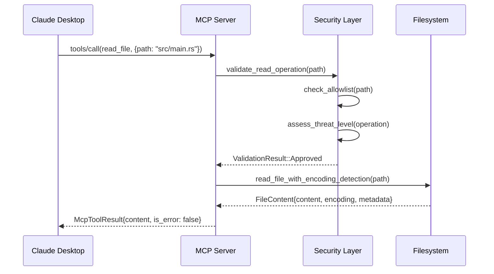
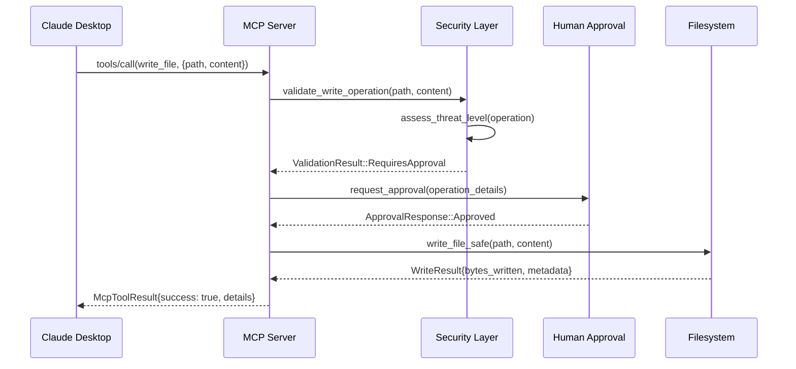

# MCP Integration Patterns for Filesystem Operations

**Category**: Integration  
**Complexity**: High  
**Last Updated**: 2025-08-22  
**Maintainer**: Core Development Team

## Overview
**What is this knowledge about?**

This document captures the integration patterns for connecting airs-mcp-fs with the Model Context Protocol (MCP) ecosystem, focusing on tool registration, message handling, and Claude Desktop compatibility.

**Why this knowledge is important**: MCP integration determines how AI agents interact with filesystem operations and affects compatibility with the broader MCP ecosystem.

**Who should read this**: Anyone implementing MCP servers, integrating with Claude Desktop, or working with the MCP protocol in the AIRS ecosystem.

## Context & Background
**When and why was this approach chosen?**

The MCP integration patterns were designed during the architecture phase to leverage the existing airs-mcp foundation while providing filesystem-specific capabilities.

**Key Integration Requirements**:
- **Claude Desktop Compatibility**: Primary target for initial deployment
- **AIRS Ecosystem Alignment**: Leverage airs-mcp transport and protocol foundations
- **Extensibility**: Support future MCP-compatible AI tools
- **Performance**: Sub-100ms response times for filesystem operations

**Related ADRs**: Future ADRs will document specific integration decisions during implementation.

## Technical Details
**How does this work?**

### Core MCP Tool Registration

#### Filesystem Tool Schema
```rust
pub fn register_filesystem_tools() -> Vec<McpTool> {
    vec![
        McpTool {
            name: "read_file".to_string(),
            description: "Read file contents with automatic encoding detection".to_string(),
            input_schema: serde_json::json!({
                "type": "object",
                "properties": {
                    "path": {
                        "type": "string",
                        "description": "File path to read"
                    },
                    "encoding": {
                        "type": "string",
                        "enum": ["auto", "utf-8", "utf-16", "latin1"],
                        "default": "auto"
                    }
                },
                "required": ["path"]
            }),
        },
        McpTool {
            name: "write_file".to_string(),
            description: "Write content to file with human approval workflow".to_string(),
            input_schema: serde_json::json!({
                "type": "object",
                "properties": {
                    "path": {
                        "type": "string",
                        "description": "File path to write"
                    },
                    "content": {
                        "type": "string",
                        "description": "Content to write to file"
                    },
                    "create_dirs": {
                        "type": "boolean",
                        "default": false,
                        "description": "Create parent directories if they don't exist"
                    }
                },
                "required": ["path", "content"]
            }),
        },
        // Additional tools: list_directory, delete_file, move_file, etc.
    ]
}
```

#### Tool Execution Framework
```rust
#[async_trait]
pub trait FilesystemToolHandler {
    async fn handle_tool_call(
        &self,
        tool_name: &str,
        parameters: serde_json::Value,
        context: &SecurityContext,
    ) -> Result<McpToolResult, FilesystemError>;
}

pub struct FilesystemMcpServer {
    security_policy: SecurityPolicy,
    approval_handler: Box<dyn ApprovalHandler>,
    audit_logger: AuditLogger,
}

impl FilesystemToolHandler for FilesystemMcpServer {
    async fn handle_tool_call(
        &self,
        tool_name: &str,
        parameters: serde_json::Value,
        context: &SecurityContext,
    ) -> Result<McpToolResult, FilesystemError> {
        match tool_name {
            "read_file" => self.handle_read_file(parameters, context).await,
            "write_file" => self.handle_write_file(parameters, context).await,
            "list_directory" => self.handle_list_directory(parameters, context).await,
            _ => Err(FilesystemError::UnknownTool(tool_name.to_string())),
        }
    }
}
```

### Message Flow Patterns

#### Read Operation Flow


#### Write Operation Flow (with Approval)


### Error Handling Patterns

#### Structured Error Responses
```rust
pub enum FilesystemError {
    SecurityViolation {
        operation: String,
        path: PathBuf,
        reason: String,
    },
    ApprovalRequired {
        operation: String,
        details: ApprovalDetails,
        timeout_ms: Option<u64>,
    },
    FilesystemError {
        operation: String,
        path: PathBuf,
        source: io::Error,
    },
    EncodingError {
        path: PathBuf,
        attempted_encoding: String,
        suggestions: Vec<String>,
    },
}

impl From<FilesystemError> for McpError {
    fn from(error: FilesystemError) -> Self {
        match error {
            FilesystemError::SecurityViolation { operation, path, reason } => {
                McpError::new(
                    ErrorCode::InvalidRequest,
                    format!("Security violation: {} on {}: {}", operation, path.display(), reason),
                    Some(serde_json::json!({
                        "type": "security_violation",
                        "operation": operation,
                        "path": path,
                        "reason": reason
                    }))
                )
            },
            FilesystemError::ApprovalRequired { operation, details, timeout_ms } => {
                McpError::new(
                    ErrorCode::MethodNotFound, // Custom code for approval required
                    format!("Human approval required for: {}", operation),
                    Some(serde_json::json!({
                        "type": "approval_required",
                        "operation": operation,
                        "details": details,
                        "timeout_ms": timeout_ms
                    }))
                )
            },
            // Additional error mappings...
        }
    }
}
```

## Code Examples
**Practical implementation examples**

### STDIO Transport Integration
```rust
use airs_mcp::transport::stdio::StdioTransport;
use airs_mcp::server::McpServer;

pub async fn start_filesystem_mcp_server() -> Result<(), Box<dyn std::error::Error>> {
    // Initialize transport using airs-mcp foundation
    let transport = StdioTransport::new();
    
    // Create filesystem-specific server
    let filesystem_server = FilesystemMcpServer::new(
        SecurityPolicy::development_default(),
        HumanApprovalHandler::new(),
        AuditLogger::new("filesystem_operations.log"),
    )?;
    
    // Register filesystem tools
    let tools = register_filesystem_tools();
    
    // Start MCP server with filesystem capabilities
    let mut server = McpServer::new(transport, filesystem_server);
    server.register_tools(tools).await?;
    
    println!("Filesystem MCP server started - ready for Claude Desktop");
    server.run().await?;
    
    Ok(())
}
```

### Tool Implementation Example
```rust
impl FilesystemMcpServer {
    async fn handle_read_file(
        &self,
        parameters: serde_json::Value,
        context: &SecurityContext,
    ) -> Result<McpToolResult, FilesystemError> {
        // Parse parameters
        let request: ReadFileRequest = serde_json::from_value(parameters)
            .map_err(|e| FilesystemError::InvalidParameters(e.to_string()))?;
        
        // Security validation
        self.security_policy.validate_read_operation(&request.path, context)?;
        
        // Threat assessment
        let threat_assessment = assess_operation_threat(
            &FilesystemOperation::ReadFile { path: request.path.clone() },
            context,
            &self.operation_history,
        );
        
        if threat_assessment.level >= ThreatLevel::High {
            return Err(FilesystemError::SecurityViolation {
                operation: "read_file".to_string(),
                path: request.path,
                reason: format!("Threat level: {:?}", threat_assessment.level),
            });
        }
        
        // Execute filesystem operation
        let file_content = read_file_with_encoding_detection(
            &request.path,
            request.encoding.as_deref(),
        ).await?;
        
        // Audit logging
        self.audit_logger.log_operation(AuditEvent {
            operation: "read_file".to_string(),
            path: request.path.clone(),
            user_context: context.clone(),
            timestamp: Utc::now(),
            result: "success".to_string(),
            metadata: Some(json!({
                "file_size": file_content.size,
                "encoding": file_content.encoding,
                "threat_level": threat_assessment.level
            })),
        }).await?;
        
        // Return successful result
        Ok(McpToolResult {
            content: vec![McpContent::Text {
                text: file_content.content,
            }],
            is_error: false,
            metadata: Some(json!({
                "encoding": file_content.encoding,
                "size": file_content.size,
                "last_modified": file_content.last_modified
            })),
        })
    }
}
```

## Performance Characteristics
**How does this perform?**

- **Tool Registration**: O(1) - constant time for tool discovery
- **Message Routing**: O(1) - direct dispatch to handlers
- **Parameter Validation**: O(n) where n = parameter complexity
- **Response Serialization**: O(m) where m = response size

**Performance Targets**:
- Tool call latency: <100ms for read operations
- Write operations: <200ms + human approval time
- Memory usage: <50MB baseline + file content buffers
- Concurrent operations: Support 10+ simultaneous filesystem operations

## Trade-offs & Limitations
**What are the constraints and compromises?**

### MCP Protocol Constraints
- **JSON-RPC Overhead**: All data must serialize to JSON
- **STDIO Limitations**: Binary data requires base64 encoding
- **Synchronous Model**: Each tool call blocks until completion
- **Error Mapping**: Filesystem errors must map to MCP error codes

### Security vs Performance
- **Validation Overhead**: Security checks add latency to every operation
- **Approval Latency**: Human approval dramatically increases operation time
- **Audit Logging**: Comprehensive logging impacts performance

### Integration Complexity
- **Transport Abstraction**: Must work across different MCP transports
- **Error Consistency**: Filesystem errors must map consistently to MCP errors
- **State Management**: Stateless protocol with stateful filesystem operations

## Dependencies
**What does this rely on?**

### Internal Dependencies
- `airs-mcp` for transport and protocol foundations
- Security framework for operation validation
- Audit logging system for compliance

### External Dependencies
- `serde_json` for MCP message serialization
- `tokio` for async filesystem operations
- `uuid` for operation tracking and correlation

### Protocol Dependencies
- MCP specification compliance for tool registration
- JSON-RPC 2.0 for message format
- JSON Schema for tool parameter validation

## Testing Strategy
**How is this tested?**

### Integration Testing with MCP
```rust
#[tokio::test]
async fn test_read_file_tool_integration() {
    let server = create_test_filesystem_server().await;
    
    // Simulate MCP tool call
    let tool_call = McpRequest::ToolCall {
        id: "test-001".to_string(),
        method: "tools/call".to_string(),
        params: json!({
            "name": "read_file",
            "arguments": {
                "path": "test_files/sample.txt"
            }
        }),
    };
    
    let response = server.handle_request(tool_call).await.unwrap();
    
    assert!(response.is_success());
    assert!(response.result.content.len() > 0);
}
```

### Claude Desktop Compatibility Testing
- End-to-end testing with actual Claude Desktop instance
- Tool discovery and registration validation
- Error handling and user experience testing
- Performance measurement under realistic usage

## Common Pitfalls
**What should developers watch out for?**

### MCP Integration Mistakes
- **Schema Mismatch**: Tool schemas that don't match implementation
- **Error Code Misuse**: Using inappropriate MCP error codes for filesystem errors
- **JSON Serialization**: Failing to handle non-UTF8 content properly
- **Async Boundaries**: Mixing blocking filesystem operations with async MCP handlers

### Performance Issues
- **Large File Handling**: Reading large files into memory for JSON response
- **Concurrent Limits**: Not limiting concurrent filesystem operations
- **Memory Leaks**: Holding file content in memory after response sent

### Security Integration Problems
- **Validation Bypass**: Skipping security validation for "convenience"
- **Context Loss**: Losing security context across async boundaries
- **Audit Gaps**: Missing MCP-level operations in audit logs

## Related Knowledge
**What else should I read?**

### Architecture Documents
- `docs/knowledges/security/security-framework-architecture.md`
- MCP protocol specification and best practices

### Integration Patterns
- airs-mcp transport layer design
- Error handling patterns across the AIRS ecosystem
- Async operation patterns for filesystem I/O

### Performance Analysis
- MCP message overhead analysis
- Filesystem operation benchmarking
- Memory usage optimization strategies

## Evolution History

### Version 1.0 (Foundation - 2025-08-22)
- **Initial Design**: MCP integration patterns established
- **Key Features**: Tool registration, security integration, Claude Desktop compatibility
- **Status**: Design phase - implementation pending

### Future Enhancements Planned
- **Binary Support**: Enhanced binary file handling through MCP
- **Streaming**: Large file streaming for better memory efficiency
- **Batch Operations**: Multiple filesystem operations in single MCP call
- **Advanced Tools**: Directory synchronization, file watching, search capabilities

### Integration Evolution
1. **Basic Tools**: Core read/write/list operations
2. **Advanced Operations**: Move, copy, permissions, metadata
3. **Intelligent Features**: Content analysis, automatic organization
4. **Ecosystem Integration**: Cross-tool collaboration and data sharing

This integration framework provides the foundation for airs-mcp-fs to participate effectively in the MCP ecosystem while maintaining security and performance standards.
