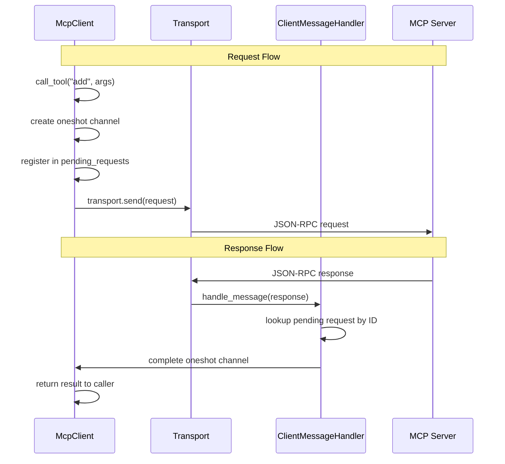

# ARCHITECTURAL ANALYSIS: MCP Client Refactoring - 2025-09-11

## 🔍 CRITICAL DISCOVERY: Client Module Architectural Issues

**Investigation Trigger**: Analysis of `src/integration/client.rs` module to understand MCP client implementation patterns and MessageHandler necessity.

**Key Discovery**: The current MCP client implementation has **fundamental architectural problems** that render it non-functional for actual MCP operations.

## 🚨 CRITICAL ARCHITECTURAL ISSUES IDENTIFIED

### 1. **Broken Message Handler Integration**
**Problem**: `ClientMessageHandler` is created but never connected to transport
```rust
// Lines 257-260: Handler created but never used
let _handler = Arc::new(ClientMessageHandler {
    pending_requests: pending_requests.clone(),
});
// transport.set_message_handler(handler); // TODO: Fix this pattern
```

**Impact**: 
- All `send_request()` operations will hang forever
- Responses from servers are lost (no correlation mechanism)
- Request-response pattern completely broken

### 2. **Transport-Client State Architecture Mismatch**
**Problem**: Client `ConnectionState` enum conflicts with transport-level connectivity

**Transport Level** (Low-level):
- `is_connected()`: "Can I send/receive bytes?"
- STDIO: "Are background tasks running?"
- HTTP: "Is HTTP client/server ready?"

**Client Level** (MCP Protocol):
- `ConnectionState`: "What's my MCP protocol state?"
- `Connected`: "Transport works but haven't done MCP handshake"
- `Initialized`: "MCP handshake complete, server capabilities known"

**Semantic Conflict**:
```rust
transport.start().await?;  // Transport: is_running = true
*self.state.write().await = ConnectionState::Disconnected; // Client: Disconnected
// This makes no sense! Transport says "connected" but client says "disconnected"
```

### 3. **Incomplete Error Handling**
**Problem**: Empty method implementations that ignore critical errors
```rust
async fn handle_error(&self, _error: TransportError) {
    // Handle transport errors
    // For now, we'll just log or ignore them
}
```

**Missing Features**:
- No logging infrastructure integration
- No auto-retry implementation (despite config support)
- No auto-reconnect implementation (despite config support)
- No proper state transitions on errors

## 💡 WHY MCP CLIENT NEEDS MessageHandler

**Key Insight**: MCP protocol is inherently **bidirectional** over JSON-RPC 2.0:

1. **Request-Response Correlation**: Client sends requests, needs to correlate async responses
2. **Server Notifications**: Servers send notifications (resource updates, subscriptions)
3. **Event-Driven Architecture**: Eliminates blocking receive() operations
4. **Background Tasks**: Even clients need background tasks to read incoming messages

**Message Flow**:


**Without MessageHandler**: No way to receive responses → all operations hang forever.

## 🏗️ CLEAN REFACTORING PLAN (No Legacy Support)

### **Phase 1: Fix State Architecture**

**Replace ConnectionState with Clean Separation**:
```rust
/// MCP Protocol Session State (separate from transport connectivity)
#[derive(Debug, Clone, PartialEq)]
pub enum McpSessionState {
    NotInitialized,  // Haven't done MCP handshake
    Initializing,    // MCP initialize request sent
    Ready,           // MCP handshake complete
    Failed,          // MCP protocol failed
}

impl McpClient<T> {
    pub async fn transport_connected(&self) -> bool {
        self.transport.read().await.is_connected()  // Delegate to transport
    }
    
    pub async fn session_state(&self) -> McpSessionState {
        self.mcp_session.read().await.clone()  // MCP protocol state
    }
    
    pub async fn is_ready(&self) -> bool {
        self.transport_connected().await && 
        matches!(self.session_state().await, McpSessionState::Ready)
    }
}
```

### **Phase 2: Fix Transport Integration**

**Only Pre-Configured Transport Pattern**:
```rust
impl McpClientBuilder {
    /// ONLY way to create MCP client
    pub async fn build<TB: TransportBuilder>(
        self,
        transport_builder: TB,
    ) -> McpResult<McpClient<TB::Transport>> {
        // Create client-aware message handler
        let handler = Arc::new(ClientMessageHandler {
            pending_requests: pending_requests.clone(),
            mcp_session: mcp_session.clone(),
            config: self.config.clone(),
        });
        
        // Build transport with handler pre-configured
        let transport = transport_builder
            .with_message_handler(handler)  // Handler properly connected!
            .build()
            .await?;
        
        transport.start().await?;
        
        Ok(McpClient { /* ... */ })
    }
}
```

### **Phase 3: Proper Error Handling**

**Enhanced ClientMessageHandler**:
```rust
async fn handle_error(&self, error: TransportError) {
    tracing::error!("Transport error: {}", error);
    
    // Update MCP session state (not transport state)
    *self.mcp_session.write().await = McpSessionState::Failed;
    
    // Cancel all pending requests with proper error responses
    let mut pending = self.pending_requests.lock().await;
    for (request_id, sender) in pending.drain() {
        let error_response = JsonRpcResponse {
            jsonrpc: "2.0".to_string(),
            id: Some(RequestId::new_string(request_id)),
            result: None,
            error: Some(JsonRpcError::transport_error(error.to_string())),
        };
        let _ = sender.send(error_response);
    }
    
    // Implement auto-reconnect if enabled
    if self.config.auto_reconnect {
        // Spawn reconnection task
    }
}
```

### **Phase 4: Clean Operations**

**Separate MCP Initialization from Transport Connection**:
```rust
/// Initialize MCP session (separate from transport connection)
pub async fn initialize(&self) -> McpResult<ServerCapabilities> {
    // 1. Ensure transport is connected
    if !self.transport_connected().await {
        return Err(McpError::transport_not_connected());
    }
    
    // 2. Update MCP state
    *self.mcp_session.write().await = McpSessionState::Initializing;
    
    // 3. Send MCP initialize request
    let response = self.send_request(&init_request).await?;
    
    // 4. Update MCP state to Ready
    *self.mcp_session.write().await = McpSessionState::Ready;
    
    Ok(capabilities)
}
```

## 🎯 ARCHITECTURE BENEFITS

### **Clear Separation of Concerns**
- **Transport**: Handles communication channel (bytes in/out)
- **Client**: Handles MCP protocol state (handshake, capabilities, etc.)

### **Proper Async Patterns**
- Request-response correlation via oneshot channels
- Background tasks for message handling
- No blocking operations

### **Error Recovery**
- Transport errors properly handled
- MCP session state managed separately
- Auto-retry and auto-reconnect support

### **Type Safety**
- Pre-configured transport pattern eliminates handler connection errors
- Clear state enums prevent invalid operations
- Compile-time guarantees for message handling

## 📋 RECOMMENDED USAGE PATTERN

```rust
// Clean, working pattern:
let transport_builder = StdioTransportBuilder::new()
    .with_command("my-mcp-server")
    .with_args(["--config", "server.json"]);

let client = McpClientBuilder::new()
    .client_info("my-client", "1.0.0")
    .timeout(Duration::from_secs(30))
    .auto_retry(true, 3)
    .auto_initialize(true)
    .build(transport_builder)  // Handler properly connected
    .await?;

// Check states separately
println!("Transport connected: {}", client.transport_connected().await);
println!("Session state: {:?}", client.session_state().await);
println!("Ready for operations: {}", client.is_ready().await);

// Initialize MCP session
let capabilities = client.initialize().await?;

// Now operations actually work!
let tools = client.list_tools().await?;  // Won't hang!
let result = client.call_tool("add", Some(args)).await?;  // Actually works!
```

## 🚀 NEXT ACTIONS

1. **Eliminate Legacy Patterns**: Remove all broken constructors and backwards compatibility
2. **Implement Clean Architecture**: State separation, proper handler integration
3. **Add Proper Error Handling**: Logging, auto-retry, auto-reconnect
4. **Update Tests**: Test new patterns and state management
5. **Update Documentation**: Document single, correct usage pattern

## 📝 TECHNICAL DEBT IMPLICATIONS

This refactoring will resolve:
- **DEBT-ARCH-005**: Client Message Handler Integration Failure
- **DEBT-ARCH-006**: Transport-Client State Architecture Mismatch  
- **DEBT-QUALITY-002**: Incomplete Error Handling Implementation
- **DEBT-DOCS-001**: Misleading Client Usage Documentation

**Impact**: Transforms client from **completely non-functional** to **production-ready** with proper async patterns and error handling.
