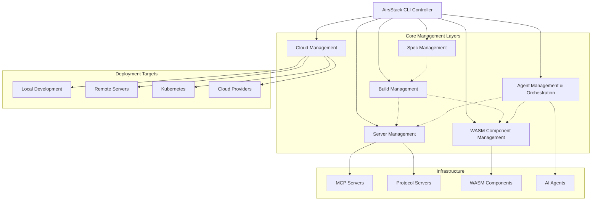
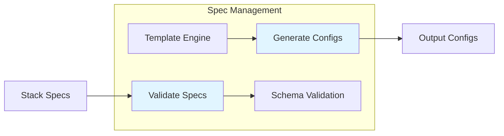
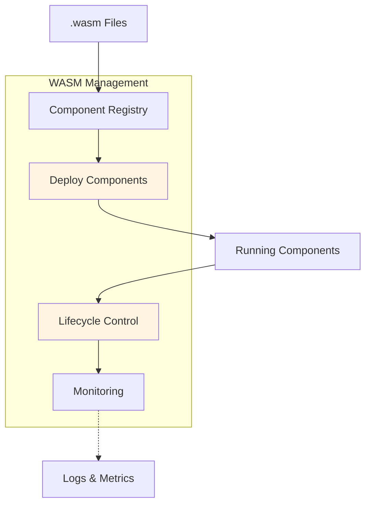
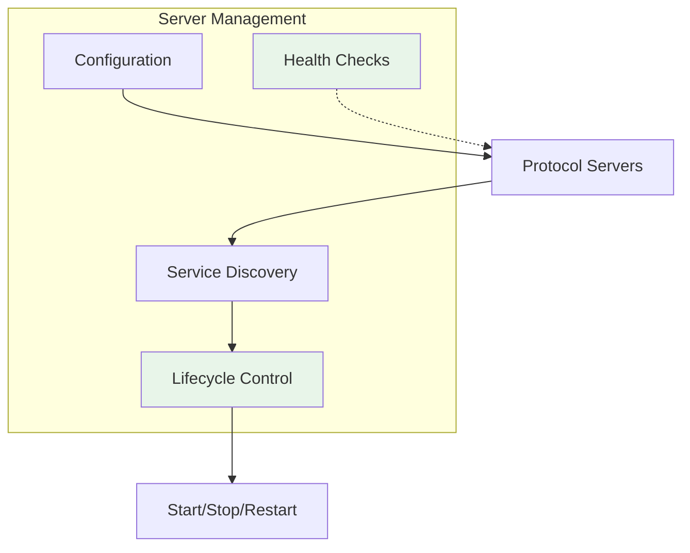
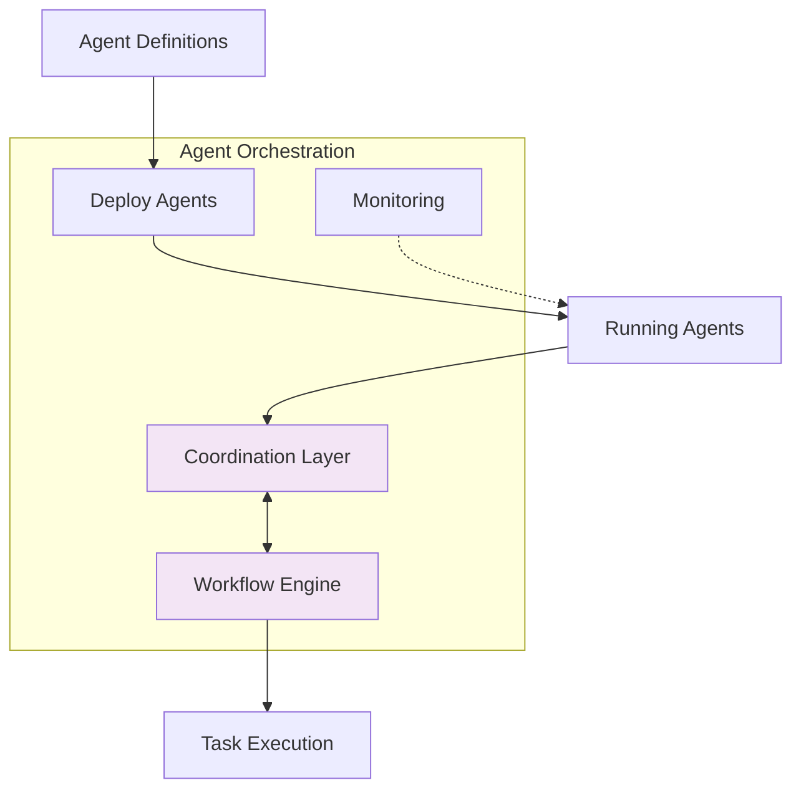
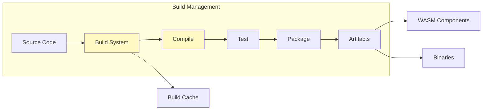
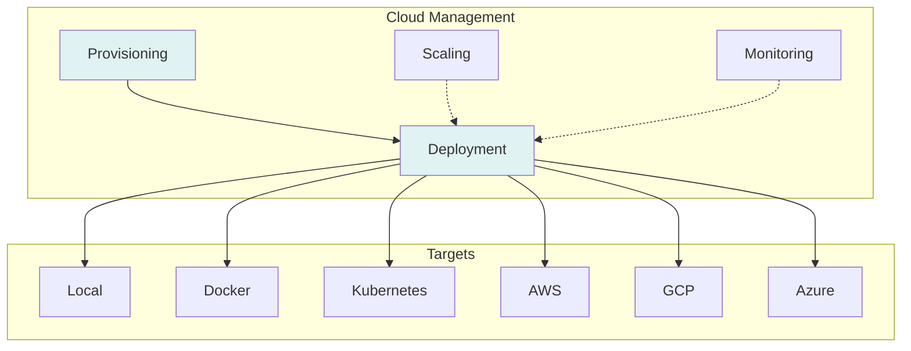
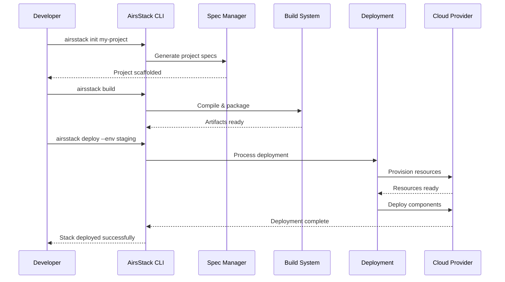

# 🚨 Repository Restructured - Important Migration Notice

[](LICENSE-MIT)

**Quick Navigation:** [Migration Guide](#migration-guide) • [New Direction](#new-direction-airsstack-controller) • [Resources](#resources)

---

## 📢 Migration Announcement

This repository has been restructured. Core packages have migrated to **[@airsprotocols](https://github.com/airsstack/airsprotocols)**.

### Migrated Packages ✅

#### **airs-mcp** → **airsprotocols-mcp**
- **Status**: Published on crates.io v1.0.0-rc.1
- **Repository**: https://github.com/airsstack/airsprotocols/tree/main/protocols/mcp
- **Documentation**: https://airsstack.github.io/airsprotocols/protocols/mcp/
- **Install**: `cargo add airsprotocols-mcp`

#### **airs-mcpserver-fs** → **airsprotocols-mcpserver-filesystem**
- **Status**: Published on crates.io v1.0.0-rc.1
- **Repository**: https://github.com/airsstack/airsprotocols/tree/main/mcp/servers/filesystem
- **Documentation**: https://airsstack.github.io/airsprotocols/servers/filesystem/
- **Install**: `cargo install airsprotocols-mcpserver-filesystem`

### Discontinued Projects ⚠️

#### **airs-memspec** - Memory specification system
- **Status**: Project discontinued
- **Reason**: No longer maintained
- **Migration Path**: None available

---

## 🎯 New Direction: AirsStack Controller

AirsStack is evolving into a **unified CLI controller** for AI infrastructure management, inspired by kubectl's approach to Kubernetes orchestration.

### Vision

A single, powerful command-line tool that serves as the control plane for:

- **AI Stack Management**: Deploy, configure, and manage complete AI stacks
- **Component Orchestration**: Lifecycle management for WASM components and services  
- **Protocol Integration**: Seamless interaction with MCP, A2A, and emerging AI protocols
- **Build Tooling**: Unified build and deployment system for the airsstack ecosystem

### Design Philosophy

**Inspired by kubectl**
- Single entry point for all operations
- Declarative configuration management
- Extensible plugin architecture
- Consistent developer experience

**Practical & Visionary**
- Start with immediate developer needs
- Build toward comprehensive AI infrastructure orchestration
- WASM-first for portability and performance
- Community-driven extensibility

### High-Level Architecture (Conceptual)

```
airsstack [command] [resource] [flags]

Commands:
  stack       Manage AI stacks and configurations
  component   Orchestrate WASM components and services
  server      Control MCP and protocol servers
  build       Build and package airsstack projects
```

### Example Vision (Conceptual)

```bash
# Manage MCP servers
airsstack server start filesystem --config ./config.toml
airsstack server list
airsstack server logs filesystem

# Deploy AI stacks
airsstack stack apply -f my-stack.yaml
airsstack stack get my-stack

# Manage WASM components
airsstack component deploy my-agent.wasm
airsstack component list
```

---

## 📖 Migration Guide

### For Existing Users

#### If you're using `airs-mcp`:

**Update your `Cargo.toml`:**
```toml
# Old
[dependencies]
airs-mcp = "0.1.0"

# New
[dependencies]
airsprotocols-mcp = "1.0.0-rc.1"
```

**Update your imports:**
```rust
// Old
use airs_mcp::*;

// New
use airsprotocols_mcp::*;
```

#### If you're using `airs-mcpserver-fs`:

**Install the new version:**
```bash
# Old
cargo install airs-mcpserver-fs

# New
cargo install airsprotocols-mcpserver-filesystem
```

**Update Claude Desktop config:**
```json
{
  "mcpServers": {
    "filesystem": {
      "command": "airsprotocols-mcpserver-filesystem",
      "args": ["serve", "--allowed-path", "/path/to/project"]
    }
  }
}
```

#### If you're using `airs-memspec`:
- This project has been discontinued
- No direct replacement available
- Consider alternative memory/context management solutions

---

## 📚 Resources

### Documentation
- **Protocol Documentation**: https://airsstack.github.io/airsprotocols/
- **MCP Protocol Guide**: https://airsstack.github.io/airsprotocols/protocols/mcp/
- **Filesystem Server Guide**: https://airsstack.github.io/airsprotocols/servers/filesystem/

### Repositories
- **airsprotocols** (protocols & servers): https://github.com/airsstack/airsprotocols
- **airsstack** (this repo): https://github.com/airsstack/airsstack

### Packages on crates.io
- **airsprotocols-mcp**: https://crates.io/crates/airsprotocols-mcp
- **airsprotocols-mcpserver-filesystem**: https://crates.io/crates/airsprotocols-mcpserver-filesystem

---

## 🗺️ Roadmap

### Current Status: Planning & Architecture Phase

The AirsStack Controller is in early conceptual design. We're defining:
- Core command structure and user experience
- Plugin architecture and extensibility model
- Integration patterns with existing protocols
- WASM component management approach

> **⚠️ Important Note**: All development plans outlined below are preliminary and subject to change based on community feedback, technical discoveries, and evolving requirements. This roadmap represents our current vision but should not be considered final.

### Architecture Overview

The following diagram illustrates the planned architecture of AirsStack Controller:



### Planned Management Capabilities

#### 1. Spec Management
Configuration and specification management for all AirsStack resources.



**Capabilities:**
- Declarative configuration files (YAML/TOML)
- Spec validation and linting
- Template system for reusable configurations
- Schema versioning and migration

#### 2. WASM Component Management
Lifecycle management for WebAssembly components.



**Capabilities:**
- WASM component deployment and versioning
- Component isolation and sandboxing
- Resource limits and quotas
- Hot-reload and updates
- Inter-component communication

#### 3. Server Management
Control plane for protocol servers (MCP, A2A, etc.).



**Capabilities:**
- Start, stop, restart servers
- Configuration management
- Health monitoring and auto-restart
- Log aggregation
- Port management and routing

#### 4. Agent Management & Orchestration
Orchestrate AI agents and their interactions.



**Capabilities:**
- Multi-agent deployment
- Agent-to-agent communication
- Workflow orchestration
- Task scheduling and distribution
- State management
- Failure handling and recovery

#### 5. Build Management
Unified build system for AirsStack projects.



**Capabilities:**
- Multi-language support (Rust, Python, JavaScript)
- Incremental builds and caching
- Cross-compilation for WASM
- Dependency management
- Testing integration
- Artifact publishing

#### 6. Cloud Management
Deploy and manage AirsStack resources across environments.



**Capabilities:**
- Multi-cloud deployment
- Container orchestration (Docker, Kubernetes)
- Infrastructure as Code
- Auto-scaling policies
- Cost optimization
- Disaster recovery

### Development Workflow



### Future Development Phases (Indicative)

**Phase 1: Foundation**
- CLI framework and core architecture
- Basic command structure
- Configuration system
- Spec management foundation

**Phase 2: Server Management**
- MCP server lifecycle management
- Protocol server orchestration
- Service discovery
- Health monitoring

**Phase 3: WASM & Component Management**
- WASM component deployment
- Component lifecycle management
- Component registry
- Inter-component communication

**Phase 4: Agent Orchestration**
- Multi-agent deployment
- Agent coordination layer
- Workflow engine
- State management

**Phase 5: Build & Cloud Integration**
- Unified build system
- Multi-language support
- Cloud provider integrations
- Kubernetes operator

**Phase 6: Ecosystem & Advanced Features**
- Plugin system
- Community extensions
- Advanced monitoring and observability
- Cost optimization tools

---

## 🚀 Project Status

**Current State**: Repository restructured, new direction announced  
**Active Development**: Protocol implementations at [@airsprotocols](https://github.com/airsstack/airsprotocols)  
**Future Development**: AirsStack Controller CLI (planning phase)

### What's Available Now

✅ **MCP Protocol Implementation** - Production-ready at [@airsprotocols](https://github.com/airsstack/airsprotocols)  
✅ **Filesystem Server** - Secure AI-filesystem operations  
✅ **Comprehensive Documentation** - Full guides and API references  
🚧 **Controller CLI** - Coming soon (in planning phase)

---

## 🤝 Community

While this repository transitions to its new focus, the airsstack ecosystem continues to grow:

- **Discussions**: https://github.com/orgs/airsstack/discussions
- **Issues**: Use [@airsprotocols](https://github.com/airsstack/airsprotocols/issues) for protocol-related issues
- **Contributing**: Contribution guidelines will be updated as the controller project takes shape

---

## 💡 Philosophy

**Your AI. Your Data. Your Control.**

AirsStack remains committed to:
- Privacy-first AI infrastructure
- Open source and community-driven development
- Composable, interoperable building blocks
- Developer-friendly tooling

---

## 📄 License

Licensed under either of:
- **Apache License, Version 2.0** ([LICENSE-APACHE](LICENSE-APACHE) or http://www.apache.org/licenses/LICENSE-2.0)
- **MIT License** ([LICENSE-MIT](LICENSE-MIT) or http://opensource.org/licenses/MIT)

at your option.

---

## 📮 Reference

**Previous State**: The pre-restructure codebase is preserved in the `archive/pre-restructure-2024-12` branch for reference.

---

**Built with 🦀 Rust | Inspired by kubectl | Powered by the AI Agent Ecosystem**
