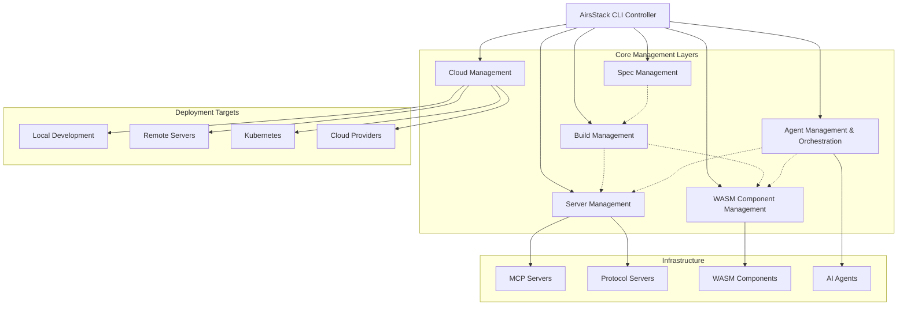
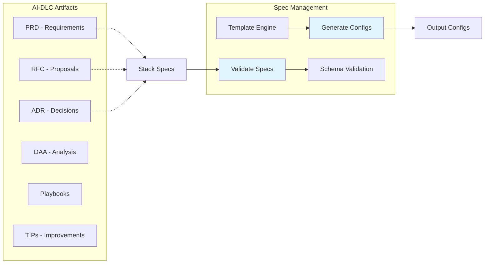
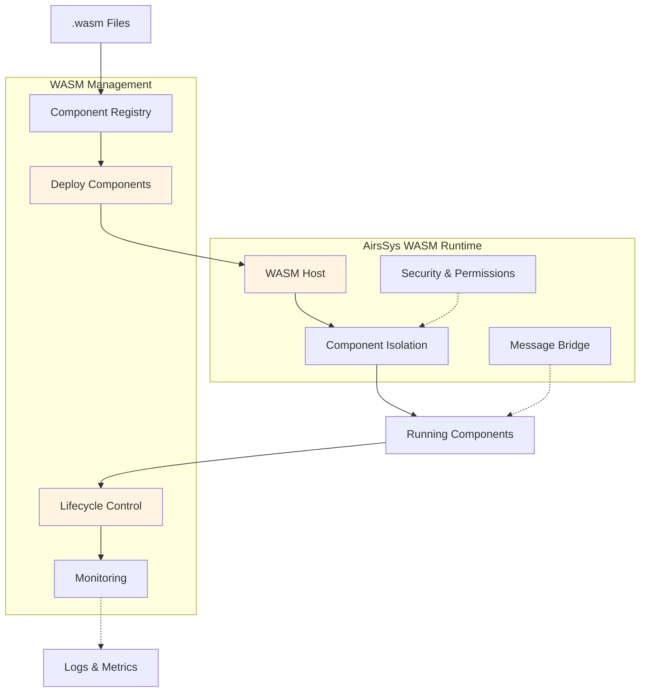
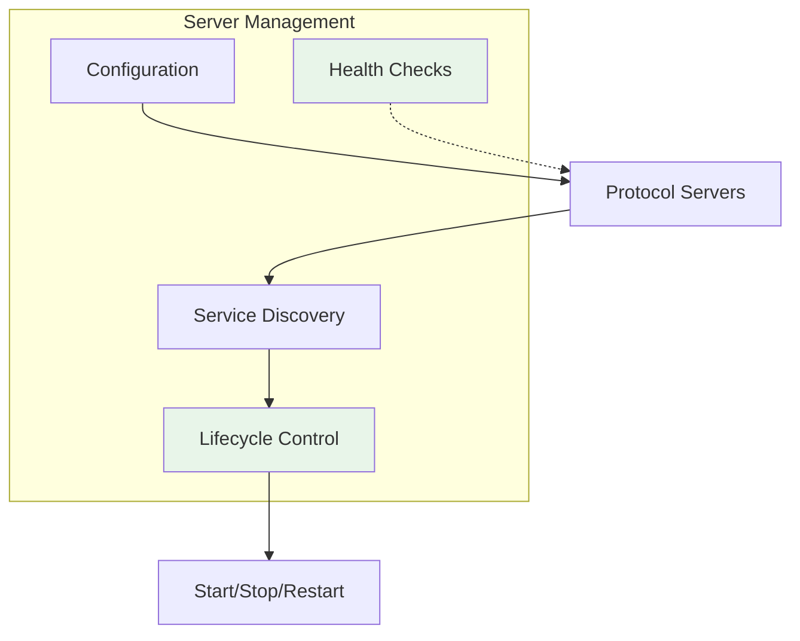
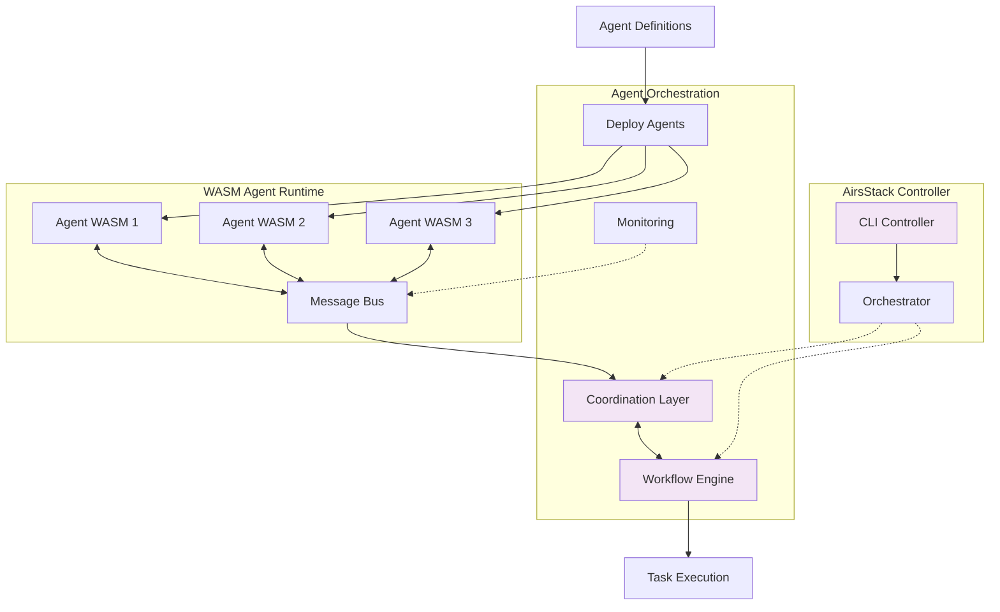
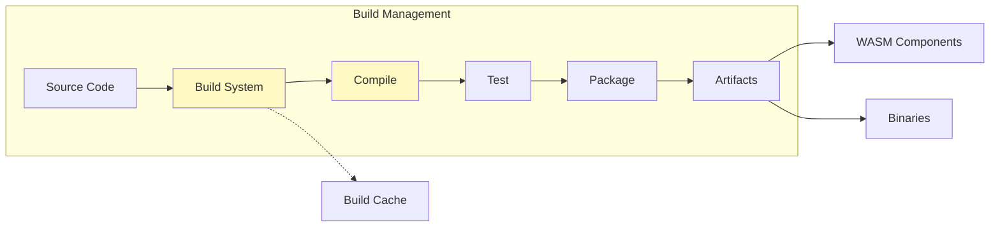
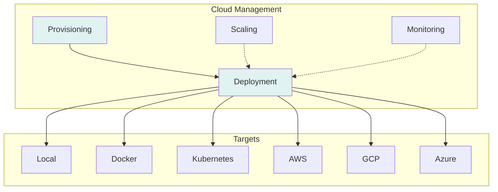
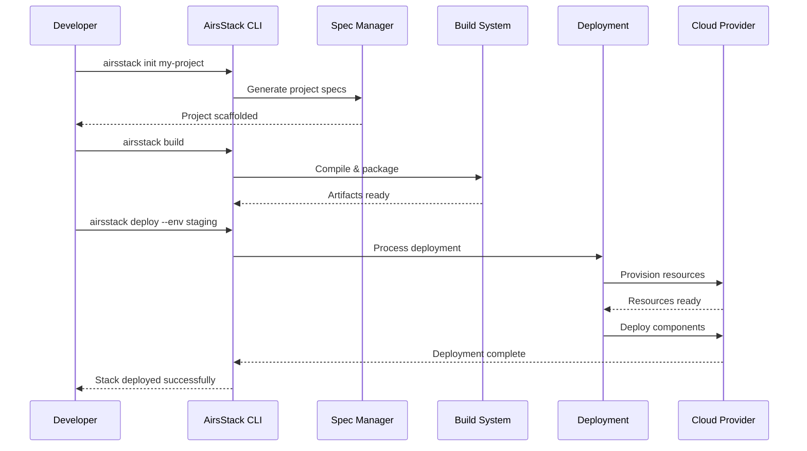

# 🚨 Repository Restructured - Important Migration Notice

[](LICENSE-MIT)

**Quick Navigation:** [Migration Guide](#migration-guide) • [New Direction](#new-direction-airsstack-controller) • [Resources](#resources)

---

## 📢 Migration Announcement

This repository has been restructured. Core packages have migrated to **[@airsprotocols](https://github.com/airsstack/airsprotocols)**.

### Migrated Packages ✅

#### **airs-mcp** → **airsprotocols-mcp**
- **Status**: Published on crates.io v1.0.0-rc.1
- **Repository**: https://github.com/airsstack/airsprotocols/tree/main/protocols/mcp
- **Documentation**: https://airsstack.github.io/airsprotocols/protocols/mcp/
- **Install**: `cargo add airsprotocols-mcp`

#### **airs-mcpserver-fs** → **airsprotocols-mcpserver-filesystem**
- **Status**: Published on crates.io v1.0.0-rc.1
- **Repository**: https://github.com/airsstack/airsprotocols/tree/main/mcp/servers/filesystem
- **Documentation**: https://airsstack.github.io/airsprotocols/servers/filesystem/
- **Install**: `cargo install airsprotocols-mcpserver-filesystem`

### Discontinued Projects ⚠️

#### **airs-memspec** - Memory specification system
- **Status**: Project discontinued
- **Reason**: No longer maintained
- **Migration Path**: None available

---

## 🎯 New Direction: AirsStack Controller

AirsStack is evolving into a **unified CLI controller** for AI infrastructure management, inspired by kubectl's approach to Kubernetes orchestration.

### Vision

A single, powerful command-line tool that serves as the control plane for:

- **AI Stack Management**: Deploy, configure, and manage complete AI stacks
- **Component Orchestration**: Lifecycle management for WASM components and services  
- **Protocol Integration**: Seamless interaction with MCP, A2A, and emerging AI protocols
- **Build Tooling**: Unified build and deployment system for the airsstack ecosystem

### Core Architecture

**WASM-First Design**

AirsStack is built on a WebAssembly-first architecture, leveraging [@airssys/airssys-wasm](https://github.com/airsstack/airssys) as the foundation:

- **Agents as WASM Components**: All AI agents are packaged as WASM binaries, ensuring portability, security, and performance
- **Plugin Architecture**: Components and plugins are WASM modules that can be loaded dynamically into the AirsStack runtime
- **Host-Component Model**: The `airsstack` CLI acts as the WASM host, managing multiple components/plugins with isolation and security
- **Inter-Component Communication**: WASM components can communicate with each other through the runtime's message-passing system

**Specification Framework**

Built on [@airsdlc](https://github.com/airsstack/airsdlc) (AI Development Lifecycle) as the core framework:

- **Standardized Specifications**: All configurations follow AI-DLC artifact guidelines (PRD, RFC, ADR, DAA, Playbooks, TIPs)
- **Lifecycle Management**: Comprehensive development lifecycle support from planning to deployment
- **Extensible Artifacts**: Support for custom artifact types and workflows
- **Attribution System**: Built-in attribution and provenance tracking

### Design Philosophy

**Inspired by kubectl**
- Single entry point for all operations
- Declarative configuration management
- Extensible plugin architecture through WASM
- Consistent developer experience

**WASM-Native**
- All agents run as isolated WASM components
- Sandboxed execution with fine-grained permissions
- Cross-platform compatibility (Linux, macOS, Windows, cloud)
- Hot-reload and zero-downtime updates

**Practical & Visionary**
- Start with immediate developer needs
- Build toward comprehensive AI infrastructure orchestration
- WASM-first for portability and performance
- Community-driven extensibility through plugin ecosystem

### High-Level Architecture (Conceptual)

```
airsstack [command] [resource] [flags]

Commands:
  stack       Manage AI stacks and configurations
  component   Orchestrate WASM components and services
  server      Control MCP and protocol servers
  build       Build and package airsstack projects
```

### Example Vision (Conceptual)

```bash
# Manage MCP servers
airsstack server start filesystem --config ./config.toml
airsstack server list
airsstack server logs filesystem

# Deploy AI stacks
airsstack stack apply -f my-stack.yaml
airsstack stack get my-stack

# Manage WASM components
airsstack component deploy my-agent.wasm
airsstack component list
```

---

## 📖 Migration Guide

### For Existing Users

#### If you're using `airs-mcp`:

**Update your `Cargo.toml`:**
```toml
# Old
[dependencies]
airs-mcp = "0.1.0"

# New
[dependencies]
airsprotocols-mcp = "1.0.0-rc.1"
```

**Update your imports:**
```rust
// Old
use airs_mcp::*;

// New
use airsprotocols_mcp::*;
```

#### If you're using `airs-mcpserver-fs`:

**Install the new version:**
```bash
# Old
cargo install airs-mcpserver-fs

# New
cargo install airsprotocols-mcpserver-filesystem
```

**Update Claude Desktop config:**
```json
{
  "mcpServers": {
    "filesystem": {
      "command": "airsprotocols-mcpserver-filesystem",
      "args": ["serve", "--allowed-path", "/path/to/project"]
    }
  }
}
```

#### If you're using `airs-memspec`:
- This project has been discontinued
- No direct replacement available
- Consider alternative memory/context management solutions

---

## 🏗️ Ecosystem Architecture

AirsStack Controller is part of a larger ecosystem of interconnected projects:

```mermaid
graph TB
    subgraph "AirsStack Ecosystem"
        AIRSSTACK[AirsStack Controller CLI]
        
        subgraph "Foundation Layer"
            AIRSDLC[@airsdlc<br/>AI-DLC Framework]
            AIRSSYS[@airssys/airssys-wasm<br/>WASM Runtime]
        end
        
        subgraph "Protocol Layer"
            AIRSPROTOCOLS[@airsprotocols<br/>Protocols & Servers]
        end
        
        subgraph "Application Layer"
            AGENTS[AI Agent Components]
            SERVERS[Protocol Servers]
            PLUGINS[Plugin Components]
        end
    end
    
    AIRSSTACK --> AIRSDLC
    AIRSSTACK --> AIRSSYS
    AIRSSTACK --> AIRSPROTOCOLS
    
    AIRSDLC -.->|Spec Framework| AIRSSTACK
    AIRSSYS -.->|WASM Runtime| AIRSSTACK
    AIRSPROTOCOLS -.->|MCP/A2A| SERVERS
    
    AIRSSTACK -->|Deploy| AGENTS
    AIRSSTACK -->|Manage| SERVERS
    AIRSSTACK -->|Load| PLUGINS
    
    AGENTS -->|Run on| AIRSSYS
    PLUGINS -->|Run on| AIRSSYS
    
    style AIRSSTACK fill:#e3f2fd
    style AIRSDLC fill:#fff3e0
    style AIRSSYS fill:#fff3e0
    style AIRSPROTOCOLS fill:#e8f5e9
```

### Project Relationships

**[@airsdlc](https://github.com/airsstack/airsdlc)** - AI Development Lifecycle Framework
- Provides standardized specification and artifact framework
- Defines PRD, RFC, ADR, DAA, Playbooks, and TIPs formats
- Used by AirsStack for spec management and configuration
- Ensures consistent lifecycle management across all tools

**[@airssys/airssys-wasm](https://github.com/airsstack/airssys)** - WASM Component Runtime
- Core WASM execution engine for all components
- Provides component isolation, security, and permission management
- Hosts all AI agents as WASM binaries
- Enables plugin architecture through WASM component model
- Powers inter-component communication and message-passing

**[@airsprotocols](https://github.com/airsstack/airsprotocols)** - Protocol Implementations
- Production-ready protocol implementations (MCP, A2A)
- Protocol servers managed by AirsStack Controller
- Integration layer between agents and external systems

**AirsStack Controller** - Orchestration & Management CLI
- Main control plane for the entire ecosystem
- Manages WASM components, agents, servers, and deployments
- Acts as WASM host for plugin and component execution
- Orchestrates multi-agent systems and cloud deployments

---

## 📚 Resources

### Documentation
- **Protocol Documentation**: https://airsstack.github.io/airsprotocols/
- **MCP Protocol Guide**: https://airsstack.github.io/airsprotocols/protocols/mcp/
- **Filesystem Server Guide**: https://airsstack.github.io/airsprotocols/servers/filesystem/

### Repositories
- **airsprotocols** (protocols & servers): https://github.com/airsstack/airsprotocols
- **airsstack** (this repo): https://github.com/airsstack/airsstack

### Packages on crates.io
- **airsprotocols-mcp**: https://crates.io/crates/airsprotocols-mcp
- **airsprotocols-mcpserver-filesystem**: https://crates.io/crates/airsprotocols-mcpserver-filesystem

---

## 🗺️ Roadmap

### Current Status: Planning & Architecture Phase

The AirsStack Controller is in early conceptual design. We're defining:
- Core command structure and user experience
- Plugin architecture and extensibility model
- Integration patterns with existing protocols
- WASM component management approach

> **⚠️ Important Note**: All development plans outlined below are preliminary and subject to change based on community feedback, technical discoveries, and evolving requirements. This roadmap represents our current vision but should not be considered final.

### Architecture Overview

The following diagram illustrates the planned architecture of AirsStack Controller:



### Planned Management Capabilities

#### 1. Spec Management
Configuration and specification management for all AirsStack resources, built on [@airsdlc](https://github.com/airsstack/airsdlc) (AI Development Lifecycle) framework.



**Capabilities:**
- **AI-DLC Framework Integration**: All specifications follow standardized AI Development Lifecycle artifacts
- **Artifact Types**: Support for PRD, RFC, ADR, DAA, Playbooks, and TIPs
- **Declarative Configuration**: YAML/TOML-based stack definitions
- **Spec Validation**: Linting and validation against AI-DLC schemas
- **Template System**: Reusable configuration templates
- **Version Management**: Schema versioning and migration support
- **Attribution Tracking**: Built-in provenance and attribution system

#### 2. WASM Component Management
Lifecycle management for WebAssembly components, leveraging [@airssys/airssys-wasm](https://github.com/airsstack/airssys) runtime.



**Capabilities:**
- **WASM Runtime**: Built on airssys-wasm for high-performance component execution
- **Plugin Architecture**: Load components dynamically as plugins into the host runtime
- **Component Isolation**: Sandboxed execution with capability-based security
- **Host-Component Model**: AirsStack CLI acts as the WASM host managing multiple components
- **Inter-Component Communication**: Message-passing between isolated components
- **Hot-Reload**: Zero-downtime component updates
- **Resource Limits**: CPU, memory, and I/O quotas per component
- **Permission System**: Fine-grained capability permissions (network, filesystem, etc.)
- **Component Registry**: Version management and dependency resolution

#### 3. Server Management
Control plane for protocol servers (MCP, A2A, etc.).



**Capabilities:**
- Start, stop, restart servers
- Configuration management
- Health monitoring and auto-restart
- Log aggregation
- Port management and routing

#### 4. Agent Management & Orchestration
Orchestrate AI agents as WASM components from [@airssys/airssys-wasm](https://github.com/airsstack/airssys), enabling multi-agent systems with secure inter-agent communication.



**Capabilities:**
- **WASM-Based Agents**: All agents packaged as WASM binaries from airssys-wasm
- **Multi-Agent Systems**: Deploy and coordinate multiple agent instances
- **Inter-Agent Communication**: Secure message-passing between agent components
- **Orchestration Control**: AirsStack CLI as the main controller for agent orchestration
- **Workflow Engine**: Define and execute multi-agent workflows
- **Task Distribution**: Intelligent task scheduling across agent pool
- **State Management**: Distributed state coordination
- **Failure Recovery**: Supervisor trees and restart strategies
- **Agent Isolation**: Each agent runs in isolated WASM sandbox
- **Cloud Deployment**: Orchestrate agents across local and cloud environments
- **Scalability**: Dynamic agent scaling based on workload

#### 5. Build Management
Unified build system for AirsStack projects.



**Capabilities:**
- Multi-language support (Rust, Python, JavaScript)
- Incremental builds and caching
- Cross-compilation for WASM
- Dependency management
- Testing integration
- Artifact publishing

#### 6. Cloud Management
Deploy and manage AirsStack resources across environments.



**Capabilities:**
- Multi-cloud deployment
- Container orchestration (Docker, Kubernetes)
- Infrastructure as Code
- Auto-scaling policies
- Cost optimization
- Disaster recovery

### Development Workflow



### Future Development Phases (Indicative)

**Phase 1: Foundation**
- CLI framework and core architecture
- Basic command structure
- Configuration system
- Spec management foundation

**Phase 2: Server Management**
- MCP server lifecycle management
- Protocol server orchestration
- Service discovery
- Health monitoring

**Phase 3: WASM & Component Management**
- WASM component deployment
- Component lifecycle management
- Component registry
- Inter-component communication

**Phase 4: Agent Orchestration**
- Multi-agent deployment
- Agent coordination layer
- Workflow engine
- State management

**Phase 5: Build & Cloud Integration**
- Unified build system
- Multi-language support
- Cloud provider integrations
- Kubernetes operator

**Phase 6: Ecosystem & Advanced Features**
- Plugin system
- Community extensions
- Advanced monitoring and observability
- Cost optimization tools

---

## 🚀 Project Status

**Current State**: Repository restructured, new direction announced  
**Active Development**: Protocol implementations at [@airsprotocols](https://github.com/airsstack/airsprotocols)  
**Future Development**: AirsStack Controller CLI (planning phase)

### What's Available Now

✅ **MCP Protocol Implementation** - Production-ready at [@airsprotocols](https://github.com/airsstack/airsprotocols)  
✅ **Filesystem Server** - Secure AI-filesystem operations  
✅ **Comprehensive Documentation** - Full guides and API references  
🚧 **Controller CLI** - Coming soon (in planning phase)

---

## 🤝 Community

While this repository transitions to its new focus, the airsstack ecosystem continues to grow:

- **Discussions**: https://github.com/orgs/airsstack/discussions
- **Issues**: Use [@airsprotocols](https://github.com/airsstack/airsprotocols/issues) for protocol-related issues
- **Contributing**: Contribution guidelines will be updated as the controller project takes shape

---

## 💡 Philosophy

**Your AI. Your Data. Your Control.**

AirsStack remains committed to:
- Privacy-first AI infrastructure
- Open source and community-driven development
- Composable, interoperable building blocks
- Developer-friendly tooling

---

## 📄 License

Licensed under either of:
- **Apache License, Version 2.0** ([LICENSE-APACHE](LICENSE-APACHE) or http://www.apache.org/licenses/LICENSE-2.0)
- **MIT License** ([LICENSE-MIT](LICENSE-MIT) or http://opensource.org/licenses/MIT)

at your option.

---

## 📮 Reference

**Previous State**: The pre-restructure codebase is preserved in the `archive/pre-restructure-2024-12` branch for reference.

---

**Built with 🦀 Rust | Inspired by kubectl | Powered by the AI Agent Ecosystem**
