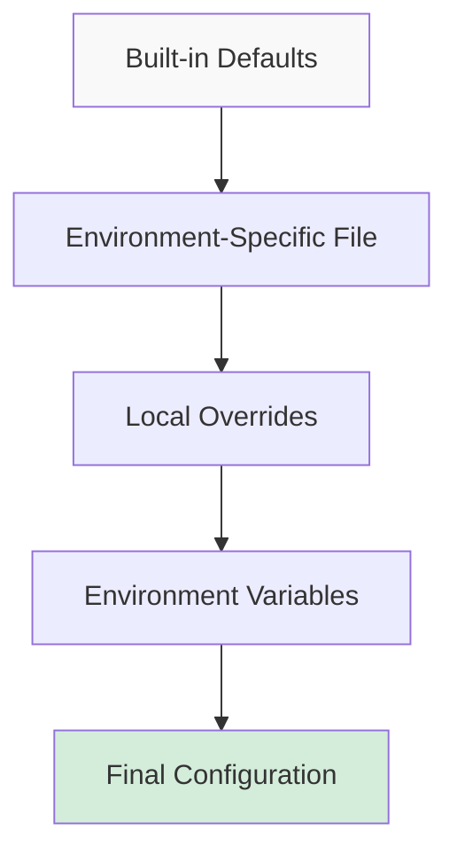

# Configuration Overview

This section provides a comprehensive overview of AIRS MCP-FS configuration system, its components, and design principles.

## Configuration Philosophy

AIRS MCP-FS configuration is built on four core principles:

1. **Security by Default**: Safe defaults that protect your system
2. **Environment Awareness**: Automatic adaptation to development/staging/production
3. **Policy-Driven Access**: Named policies for different file types and use cases
4. **12-Factor Compliance**: Environment variable overrides for deployment flexibility

## Configuration Hierarchy

The configuration system uses a layered approach where each layer can override the previous:



### Layer Details

1. **Built-in Defaults**: Secure production defaults compiled into the binary
2. **Environment-Specific File**: `development.toml`, `staging.toml`, or `production.toml`
3. **Local Overrides**: Project-specific or user-specific customizations
4. **Environment Variables**: Runtime overrides for deployment and CI/CD

## Core Configuration Sections

### Security Configuration

The heart of AIRS MCP-FS configuration, controlling file system access and operations:

```toml
[security]
# Filesystem access control
[security.filesystem]
allowed_paths = ["~/projects/**/*"]
denied_paths = ["**/.env*"]

# Operation-level controls
[security.operations]
read_allowed = true
write_requires_policy = false
delete_requires_explicit_allow = true

# Named security policies
[security.policies.source_code]
patterns = ["**/*.{rs,py,js}"]
operations = ["read", "write"]
risk_level = "low"
```

**Key Features:**
- **Path-based access control** using glob patterns
- **Operation-level permissions** for read/write/delete
- **Named policies** for different file types
- **Risk-level categorization** for audit logging

### Binary Processing Configuration

Controls how AIRS MCP-FS handles images, PDFs, and other binary files:

```toml
[binary]
max_file_size = 104857600           # 100MB
enable_image_processing = true
enable_pdf_processing = true
```

**Capabilities:**
- **File size limits** to prevent resource exhaustion
- **Format-specific processing** for images and PDFs
- **Metadata extraction** from binary files
- **Thumbnail generation** for images

### Server Configuration

Basic MCP server identity and capabilities:

```toml
[server]
name = "airs-mcp-fs"
version = "1.0.0"
```

## Environment Detection

AIRS MCP-FS automatically detects the runtime environment using multiple strategies:

### Environment Variable Detection

Checked in order of preference:

1. `AIRS_MCP_FS_ENV` - AIRS-specific environment
2. `NODE_ENV` - Node.js convention
3. `ENVIRONMENT` - Generic environment variable

### Automatic Detection

If no environment variables are set:

- **Debug builds**: Default to `development`
- **Release builds**: Default to `production`
- **Test runs**: Automatically use `test` environment

### Environment-Specific Defaults

Each environment has different security defaults:

| Environment | Write Policy | Delete Policy | Allowed Paths |
|-------------|--------------|---------------|---------------|
| **Production** | Policy Required | Explicit Allow | Minimal |
| **Staging** | Policy Required | Explicit Allow | Moderate |
| **Development** | Allowed | Explicit Allow | Broad |
| **Test** | Allowed | Allowed | Universal |

## File Discovery Process

AIRS MCP-FS searches for configuration files using a systematic approach:

```
1. Check AIRS_MCP_FS_CONFIG_DIR environment variable
   └── $AIRS_MCP_FS_CONFIG_DIR/{environment}.toml

2. Check user configuration directory
   └── ~/.config/airs-mcp-fs/{environment}.toml

3. Check system configuration directory
   └── /etc/airs-mcp-fs/{environment}.toml

4. Use built-in defaults
   └── Compiled secure defaults
```

### Configuration File Naming

- `development.toml` - Development environment
- `staging.toml` - Staging environment  
- `production.toml` - Production environment
- `test.toml` - Testing environment

## Security Policy System

Named policies provide fine-grained control over file access patterns:

### Policy Components

```toml
[security.policies.example_policy]
patterns = ["**/*.txt"]              # Glob patterns
operations = ["read", "write"]       # Allowed operations
risk_level = "low"                   # Risk category
description = "Text files policy"   # Human description
```

### Built-in Policies

AIRS MCP-FS includes several built-in policies:

- **source_code**: Programming language files
- **documentation**: Markdown, text, and doc files
- **config_files**: Configuration and settings files
- **build_artifacts**: Build outputs and temporary files

### Risk Levels

Risk levels control audit logging and monitoring:

- **Low**: Normal operations, minimal logging
- **Medium**: Moderate risk, standard logging
- **High**: Elevated risk, detailed logging
- **Critical**: High-risk operations, comprehensive audit

## Environment Variable Overrides

All configuration values can be overridden using environment variables:

### Variable Naming Convention

Environment variables use the prefix `AIRS_MCP_FS_` followed by the configuration path in uppercase:

```
Configuration: security.filesystem.allowed_paths
Environment:   AIRS_MCP_FS_SECURITY_FILESYSTEM_ALLOWED_PATHS
```

### Common Overrides

```bash
# Environment and directories
export AIRS_MCP_FS_ENV=development
export AIRS_MCP_FS_CONFIG_DIR=~/.config/airs-mcp-fs
export AIRS_MCP_FS_LOG_DIR=~/.local/share/airs-mcp-fs/logs

# File size limits
export AIRS_MCP_FS_BINARY_MAX_FILE_SIZE=52428800  # 50MB

# Security overrides
export AIRS_MCP_FS_SECURITY_OPERATIONS_READ_ALLOWED=true
```

### Array Values

For configuration arrays (like `allowed_paths`), use comma-separated values:

```bash
export AIRS_MCP_FS_SECURITY_FILESYSTEM_ALLOWED_PATHS="~/projects/**/*,~/docs/**/*"
```

## Configuration Validation

AIRS MCP-FS validates configuration at startup:

### Validation Checks

1. **Path Validation**: Ensures glob patterns are valid
2. **Size Limits**: Validates file size limits are reasonable
3. **Policy Consistency**: Checks that policies reference valid operations
4. **Environment Compatibility**: Warns about potential security issues

### Error Handling

Configuration errors are handled gracefully:

- **Invalid patterns**: Logged with suggestions for correction
- **Missing files**: Falls back to secure defaults
- **Permission errors**: Detailed error messages with solutions

## Configuration Best Practices

### Security Best Practices

1. **Principle of Least Privilege**: Grant minimal necessary permissions
2. **Regular Audits**: Review configuration periodically
3. **Environment Separation**: Use different configs for different environments
4. **Documentation**: Comment complex policies and patterns

### Performance Best Practices

1. **Specific Patterns**: Use precise glob patterns to avoid unnecessary checks
2. **Reasonable Size Limits**: Set appropriate file size limits
3. **Binary Processing**: Disable unused binary processing features
4. **Caching**: Leverage built-in configuration caching

### Maintenance Best Practices

1. **Version Control**: Keep configuration files in version control
2. **Testing**: Test configuration changes before deployment
3. **Monitoring**: Monitor configuration effectiveness
4. **Documentation**: Maintain up-to-date configuration documentation

## Related Sections

- **[Environment Setup](./environment.md)**: Detailed environment configuration
- **[Security Policies](./security.md)**: Advanced security policy configuration  
- **[Claude Desktop Integration](./claude_desktop.md)**: MCP client setup
- **[Troubleshooting](./troubleshooting.md)**: Configuration problem solving
