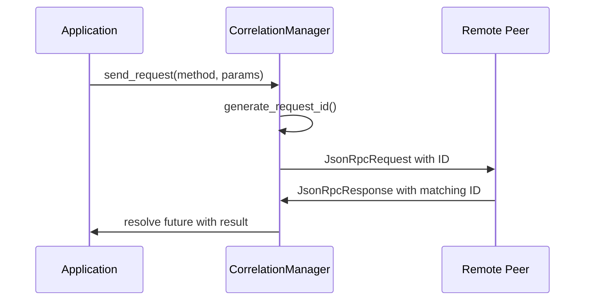

# Advanced JSON-RPC Architecture Knowledge

**Created**: 2025-07-28  
**Status**: Knowledge Preservation - Future Implementation  
**Context**: Advanced concepts documented during core-first implementation strategy  

## Correlation Manager Architecture (Future Phase)

### Core Concepts
The Correlation Manager solves bidirectional request/response matching in concurrent scenarios through:

#### Request ID Correlation Pattern
```rust
// Future implementation concept
pub struct CorrelationManager {
    pending_requests: DashMap<RequestId, PendingRequest>,
    request_counter: AtomicI64,
    default_timeout: Duration,
}

struct PendingRequest {
    sender: oneshot::Sender<Result<JsonRpcResponse, CorrelationError>>,
    sent_at: Instant,
    timeout: Duration,
}
```

#### Bidirectional Communication Flow


#### Key Design Principles
- **Lock-Free Concurrency**: DashMap for O(1) correlation operations
- **Timeout Management**: Per-request and global timeout strategies
- **Memory Safety**: Automatic cleanup of expired requests
- **Error Propagation**: Structured error types for debugging

### Thread-Safe Request Lifecycle
1. **Generate**: Unique request ID creation (UUID or atomic counter)
2. **Register**: Store pending request with oneshot channel
3. **Send**: Transmit request through transport layer
4. **Correlate**: Match incoming response by ID
5. **Resolve**: Complete future with result or timeout error
6. **Cleanup**: Remove completed/expired requests

### Performance Characteristics
- **Correlation Lookup**: O(1) average case with DashMap
- **ID Generation**: Lock-free atomic operations
- **Memory Overhead**: Minimal per-request metadata
- **Cleanup Efficiency**: Batch processing of expired requests

## Transport Abstraction Architecture (Future Phase)

### Transport Trait Design
```rust
#[async_trait]
pub trait Transport: Send + Sync {
    async fn send(&self, data: Bytes) -> Result<(), TransportError>;
    async fn receive(&self) -> Result<Bytes, TransportError>;
    async fn close(&self) -> Result<(), TransportError>;
    fn is_connected(&self) -> bool;
}
```

### STDIO Transport Implementation
```rust
pub struct StdioTransport {
    reader: tokio::sync::Mutex<FramedRead<tokio::io::Stdin, LinesCodec>>,
    writer: tokio::sync::Mutex<FramedWrite<tokio::io::Stdout, LinesCodec>>,
    connected: std::sync::atomic::AtomicBool,
}
```

#### Message Framing Strategy
- **Newline-Delimited JSON**: Each message terminated with `\n`
- **Streaming Parser**: Handle partial reads and message boundaries
- **Buffer Management**: Reuse buffers to minimize allocations

### Future Transport Implementations
- **HTTP Transport**: RESTful JSON-RPC over HTTP/HTTPS
- **WebSocket Transport**: Real-time bidirectional communication
- **TCP Transport**: Direct socket communication for high throughput

## Integration Architecture (Future Phase)

### High-Level Client Interface
```rust
pub struct JsonRpcClient {
    correlation: Arc<CorrelationManager>,
    transport: Arc<dyn Transport>,
    message_handler: Arc<dyn MessageHandler>,
}

impl JsonRpcClient {
    pub async fn call(&self, method: &str, params: Option<Value>) -> Result<Value, JsonRpcError>;
    pub async fn notify(&self, method: &str, params: Option<Value>) -> Result<(), JsonRpcError>;
    pub fn register_handler<F>(&self, method: &str, handler: F) where F: MessageHandler;
}
```

### Message Processing Pipeline
```mermaid
graph LR
    subgraph "Incoming Messages"
        Recv[Transport.receive()] --> Parse[Parse JSON]
        Parse --> Route[Route by Type]
    end
    
    subgraph "Message Types"
        Route --> Req[Request Handler]
        Route --> Resp[Response Correlator] 
        Route --> Notif[Notification Handler]
    end
    
    subgraph "Processing"
        Req --> App[Application Handler]
        Resp --> Corr[Correlation Manager]
        Notif --> App
    end
```

## Error Handling Architecture (Future Phase)

### Structured Error Hierarchy
```rust
#[derive(Error, Debug)]
pub enum JsonRpcSystemError {
    #[error("Transport error: {0}")]
    Transport(#[from] TransportError),
    
    #[error("Correlation error: {0}")]
    Correlation(#[from] CorrelationError),
    
    #[error("Parse error: {0}")]
    Parse(#[from] serde_json::Error),
    
    #[error("Protocol error: {0}")]
    Protocol(JsonRpcError),
}
```

### Error Context Preservation
- **Error Chaining**: Maintain causal error relationships
- **Request Context**: Include request ID in all error traces
- **Transport Context**: Preserve connection state information
- **Timeout Context**: Include timing information for debugging

## Performance Architecture (Future Phase)

### Zero-Copy Optimizations
- **Bytes Type**: Avoid string allocations during message handling
- **Buffer Pools**: Reuse parsing buffers across requests
- **Streaming JSON**: Parse messages without full buffering
- **Reference Counting**: Share message data across handlers

### Concurrent Processing Model
- **Request Parallelism**: Process multiple requests simultaneously
- **Response Correlation**: Non-blocking correlation lookup
- **Handler Isolation**: Separate async tasks for each handler
- **Backpressure Management**: Flow control for high-throughput scenarios

### Memory Management Strategy
- **Bounded Queues**: Prevent memory exhaustion under load
- **Timeout Cleanup**: Periodic removal of expired resources
- **Connection Pooling**: Reuse transport connections efficiently
- **Metric Collection**: Monitor memory usage and performance

## Implementation Roadmap (Future Phases)

### Phase 1: Core JSON-RPC (Current Focus)
- Message types and serialization
- Basic validation and error handling
- Simple request/response without correlation

### Phase 2: Correlation Layer
- Implement CorrelationManager with DashMap
- Add request ID generation strategies
- Build timeout and cleanup mechanisms

### Phase 3: Transport Abstraction  
- Define Transport trait
- Implement STDIO transport with framing
- Add connection lifecycle management

### Phase 4: Integration Layer
- High-level JsonRpcClient interface
- Message routing and handler registration
- End-to-end request/response flow

### Phase 5: Performance Optimization
- Zero-copy message processing
- Buffer pooling and memory optimization
- Concurrent processing pipeline

### Phase 6: Advanced Transports
- HTTP/HTTPS transport implementation
- WebSocket transport for real-time communication
- Performance benchmarking and optimization

This knowledge base preserves the advanced architectural concepts while allowing focused implementation of the JSON-RPC core foundation.