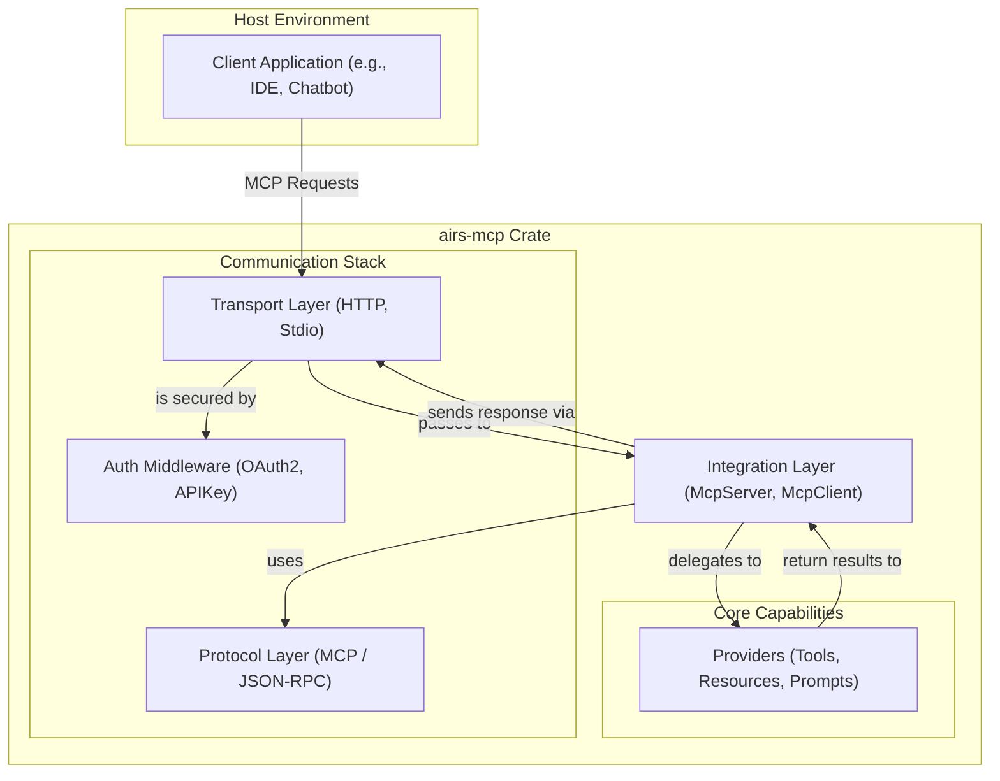

# airs-mcp

A Rust implementation of the Model Context Protocol (MCP).

## Overview

`airs-mcp` provides the core components for building clients and servers that communicate using the Model Context Protocol (MCP). The protocol is designed to facilitate communication between a language model and a host environment, enabling the model to access external capabilities like tools, resources, and prompt templates. This crate offers a type-safe, asynchronous API for implementing the full MCP specification.

## Core Features

*   **MCP Client and Server**: High-level builders (`McpClientBuilder`, `McpServerBuilder`) for configuring and launching MCP endpoints.
*   **Capability Providers**: A trait-based system for implementing the three core MCP capabilities:
    *   `ToolProvider`: Expose functions for the model to execute.
    *   `ResourceProvider`: Provide data or content that the model can access.
    *   `PromptProvider`: Supply templates for generating structured prompts.
*   **Transport Agnostic**: The integration layer is decoupled from the underlying communication channel. The crate includes two transport implementations:
    *   `StdioTransport`: For communicating over standard input/output, suitable for local subprocess integration.
    *   `HttpTransport`: For network-based communication using HTTP.
*   **Authentication and Authorization**: Built-in strategies for securing MCP endpoints.
    *   **Authentication**: Supports API Key and OAuth2 authentication methods.
    *   **Authorization**: A middleware for enforcing access policies on incoming requests.

## Installation

Add `airs-mcp` to your project's `Cargo.toml`:

```toml
[dependencies]
airs-mcp = { path = "path/to/airsstack/crates/airs-mcp" }
# or if published
# airs-mcp = "0.1.0"
```

## Usage

This section provides examples for setting up both an MCP server and a client.

### Server Usage

Here is a minimal example of an MCP server that provides a simple "add" tool and communicates over standard I/O. This setup is ideal for integration with client applications like Claude Desktop, where the server is run as a subprocess.

```rust
use std::sync::Arc;
use async_trait::async_trait;
use serde_json::json;
use airs_mcp::protocol::{JsonRpcMessage, MessageContext, MessageHandler};
use airs_mcp::providers::{ToolProvider, ToolCall, ToolResult};
use airs_mcp::transport::adapters::stdio::StdioTransport;
use airs_mcp::IntegrationError;

// 1. Implement a Tool Provider
struct MyToolProvider;

#[async_trait]
impl ToolProvider for MyToolProvider {
    async fn call_tool(&self, tool_call: ToolCall) -> Result<ToolResult, IntegrationError> {
        if tool_call.name == "add" {
            let params = tool_call.params.unwrap_or_default();
            let a = params["a"].as_i64().unwrap_or(0);
            let b = params["b"].as_i64().unwrap_or(0);
            let result = a + b;
            Ok(ToolResult::success(json!({ "result": result })))
        } else {
            Err(IntegrationError::MethodNotFound(tool_call.name))
        }
    }
    // Other required methods (list_tools, etc.) would be implemented here.
}

// 2. Create a Message Handler to host the provider
struct MyHandler {
    tool_provider: Arc<dyn ToolProvider>,
}

#[async_trait]
impl MessageHandler<()> for MyHandler {
    async fn handle_message(&self, message: JsonRpcMessage, context: MessageContext<()>) {
        // A real implementation would route the message to the correct provider.
        println!("Received message: {:?}", message);
    }
}

// 3. Configure and run the server
#[tokio::main]
async fn main() -> Result<(), Box<dyn std::error::Error>> {
    let tool_provider = Arc::new(MyToolProvider);
    let handler = Arc::new(MyHandler { tool_provider });

    let mut transport = StdioTransport::new(handler);

    // The server is now ready to communicate over stdin/stdout.
    transport.start().await?;
    transport.wait_for_completion().await?;

    Ok(())
}
```

### Client Usage

Here is how you could create an `McpClient` to connect to the server. This example uses the `McpClientBuilder` and assumes the server is running as a subprocess.

```rust
use std::process::Stdio;
use std::time::Duration;
use tokio::process::Command;
use airs_mcp::McpClientBuilder;
use airs_mcp::transport::adapters::stdio::StdioTransport;

#[tokio::main]
async fn main() -> Result<(), Box<dyn std::error::Error>> {
    // 1. Spawn the server as a subprocess
    let mut child = Command::new("path/to/your/mcp-server-binary")
        .stdin(Stdio::piped())
        .stdout(Stdio::piped())
        .spawn()?;

    let stdin = child.stdin.take().unwrap();
    let stdout = child.stdout.take().unwrap();

    // 2. Create a transport that communicates with the subprocess
    let transport = StdioTransport::from_child_process(stdin, stdout);

    // 3. Build the client
    let client = McpClientBuilder::new()
        .client_info("my-mcp-client", "0.1.0")
        .timeout(Duration::from_secs(10))
        .build(transport)
        .await?;

    // 4. Use the client to interact with the server
    println!("Listing available tools...");
    let tools = client.list_tools().await?;
    println!("Available tools: {:?}", tools);

    // The client will handle shutting down the transport when it's dropped.
    Ok(())
}
```

## Architecture

The crate is designed with a layered architecture to separate concerns.



*   **Protocol Layer (`protocol/`)**: Contains the core data structures and traits that represent the JSON-RPC 2.0 and MCP specifications. This layer ensures that all communication is spec-compliant.
*   **Transport Layer (`transport/`)**: Provides an abstraction (`Transport` trait) for sending and receiving messages. Concrete implementations like `StdioTransport` and `HttpTransport` handle the specifics of the communication channel.
*   **Providers Layer (`providers/`)**: Defines the traits (`ToolProvider`, `ResourceProvider`, `PromptProvider`) that users implement to provide capabilities to the model.
*   **Integration Layer (`integration/`)**: Contains the high-level `McpServer` and `McpClient` structs, which tie the other layers together into a cohesive API.
*   **Authentication & Authorization (`authentication/`, `authorization/`)**: Provides middleware and strategies for securing the server.

## Documentation

This crate includes comprehensive documentation built with [mdBook](https://github.com/rust-lang/mdBook), the official Rust project for creating books from Markdown files. The source files for the book are located in the `docs/src` directory within this crate.

### Setup

To build and view the book locally, you first need to install the `mdbook` tool using `cargo`.

```bash
cargo install mdbook
```

### Building and Viewing the Book

Once `mdBook` is installed, navigate to this crate's root directory (`crates/airs-mcp`) and use the `mdbook serve` command to build the book and start a local web server.

```bash
# From the airs-mcp/docs crate directory
mdbook serve docs
```

This will make the book available at `http://localhost:3000`. The server will automatically rebuild the book and reload your browser whenever you make changes to the source files.

## Examples

For more detailed and runnable examples, please see the `examples/` directory in the crate root. These include:

*   **stdio-server-integration**: A server that communicates over standard I/O.
*   **http-oauth2-server-integration**: A server that uses HTTP and is secured with OAuth2.

### Integrating with Claude Desktop

This guide provides a step-by-step walkthrough for integrating the `stdio-server-integration` example with Claude Desktop. It follows the best practices outlined in the official MCP documentation.

#### Critical Prerequisite: File-Based Logging

The MCP `stdio` transport protocol requires that the server's `stdout` and `stderr` channels be used exclusively for JSON-RPC messages. Therefore, your server **must not** print logs or any other information to the console.

The `stdio-server-integration` example uses a logging utility that can be configured via environment variables to write to a file. You **must** configure this for the integration to work.

#### Step 1: Build the Example Binary

First, compile the `stdio-server-integration` example in release mode to create an optimized executable.

```bash
# From the root of the airsstack workspace
cargo build --release --example stdio-server-integration
```

This command will create a binary inside the `target/release/examples/` directory of your workspace. You will need the absolute path to this `stdio-server-integration` binary for the configuration file.

#### Step 2: Test with the MCP Inspector

Before configuring Claude Desktop, it is crucial to verify that the server works correctly in isolation using the official MCP Inspector tool.

```bash
# Run the inspector against your newly built server binary
npx @modelcontextprotocol/inspector
```

If the inspector launches and successfully lists the server's capabilities (e.g., "Math operations," "Filesystem access"), your server is ready for integration. If it fails, debug the server using the inspector's output before proceeding.

#### Step 3: Configure Claude Desktop

Claude Desktop loads its MCP server configuration from a specific JSON file located in your user library.

1.  **Create or Edit the Configuration File:**
    Open (or create) the file at this exact path:
    `~/Library/Application Support/Claude/claude_desktop_config.json`

2.  **Add the Server Configuration:**
    Insert the following JSON object into the file. This configuration tells Claude Desktop how to launch and communicate with your server.

    ```json
    {
      "mcpServers": {
        "airs-stdio-server": {
          "command": "<absolute-path-to-your-airsstack-workspace>/target/release/examples/stdio-server-integration",
          "args": [],
          "env": {
            "RUST_LOG": "info",
            "MCP_LOG_TO_FILE": "true",
            "MCP_LOG_FILE_PATH": "<absolute-path-to-your-airsstack-workspace>/server.log"
          }
        }
      }
    }
    ```

#### Step 4: Understanding the Configuration

*   **`mcpServers`**: The required top-level key for all MCP server definitions.
*   **`airs-stdio-server`**: A unique name for your server instance within Claude Desktop.
*   **`command`**: The **absolute path** to the executable you built in Step 1.
*   **`args`**: The `stdio-server-integration` example does not require command-line arguments, so this is an empty array.
*   **`env`**: A map of environment variables to configure the server process.
    *   `RUST_LOG`: Sets the logging verbosity.
    *   `MCP_LOG_TO_FILE`: **Crucial.** This variable (assuming it's implemented in the server's logging utility) directs logs to a file instead of `stderr`.
    *   `MCP_LOG_FILE_PATH`: Specifies the path for the log file.

#### Step 5: Restart and Verify

1.  **Completely quit and restart** the Claude Desktop application.
2.  Upon restart, a **plug-shaped MCP icon** should appear in the bottom-right of the chat input field.
3.  Clicking the icon should show the tools provided by your server (e.g., "Math operations").

If the icon does not appear, check the Claude Desktop logs (`~/Library/Logs/Claude/mcp.log`) and the server's own log file (e.g., `server.log` in your workspace root) for errors.

## Contributing

Contributions are welcome. Please feel free to submit issues and pull requests. Before submitting a pull request, please ensure the test suite passes by running:

```bash
cargo test --workspace
```

## License

This project is licensed under either of the following, at your option:

*   Apache License, Version 2.0, ([LICENSE-APACHE](LICENSE-APACHE) or http://www.apache.org/licenses/LICENSE-2.0)
*   MIT license ([LICENSE-MIT](LICENSE-MIT) or http://opensource.org/licenses/MIT)
