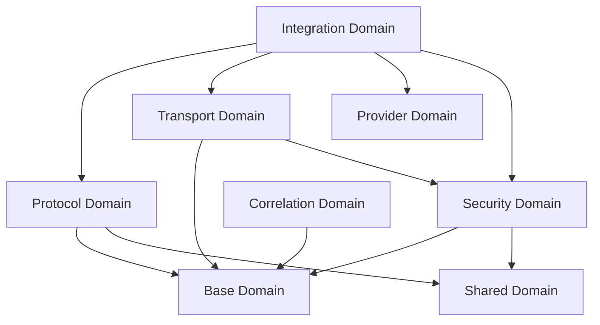

# Domain Architecture & Component Boundaries

## Production Domain Architecture

The actual domain architecture is organized as a modular system with clear boundaries between responsibilities. Below is the real-world production domain structure as implemented in the codebase.

```rust
// ACTUAL PRODUCTION DOMAIN ARCHITECTURE

// 1. Security Domains (Production-Ready)
pub mod authentication {    // Zero-cost authentication framework
    pub mod strategies {    // Authentication strategy implementations
        pub mod apikey;     // API Key authentication
        pub mod oauth2;     // OAuth2 authentication
    }
    pub mod context;       // Authentication contexts
    pub mod manager;        // Authentication management
    pub mod strategy;       // Authentication strategy trait
}

pub mod authorization {     // Zero-cost authorization framework
    pub mod context;        // Authorization contexts
    pub mod middleware;     // Authorization middleware
    pub mod policy;         // Authorization policies
    pub mod extractor;      // Method extractors
}

pub mod oauth2 {            // Complete OAuth2 2.1 implementation
    pub mod lifecycle;      // Token lifecycle management
    pub mod middleware;     // OAuth2 middleware integration
    pub mod validator;      // JWT and scope validation
    pub mod context;        // OAuth2 authentication context
    pub mod config;         // OAuth2 configuration
}

// 2. Transport Domains (Production-Ready)
pub mod transport {         // Transport layer foundation
    pub mod adapters {      // Transport implementations
        pub mod http {      // HTTP transport ecosystem
            pub mod axum;   // Axum server integration
            pub mod auth;   // HTTP authentication
            pub mod sse;    // Server-Sent Events
            pub mod client; // HTTP client
            pub mod server; // HTTP server
        }
        pub mod stdio;     // STDIO transport
    }
    pub mod mcp;           // MCP transport abstractions
    pub mod zero_copy;      // Zero-copy optimizations
    pub mod streaming;      // Streaming capabilities
    pub mod buffer;         // Advanced buffer management
}

// 3. Protocol Domains (Production-Ready)
pub mod base {              // Foundation layer
    pub mod jsonrpc {       // JSON-RPC 2.0 implementation
        pub mod message;    // Message types
        pub mod concurrent; // Concurrent processing
        pub mod streaming;  // Streaming parser
    }
}

pub mod shared {            // Shared components
    pub mod protocol {      // MCP protocol implementation
        pub mod messages {  // MCP message types
            pub mod resources; // Resource operations
            pub mod tools;     // Tool operations
            pub mod prompts;   // Prompt operations
            pub mod logging;   // Logging operations
        }
        pub mod types;     // MCP type definitions
    }
}

// 4. Integration Domains (Production-Ready)
pub mod integration {       // High-level API integration
    pub mod mcp {           // MCP integration layer
        pub mod client;     // MCP client implementation
        pub mod server;     // MCP server implementation
    }
    pub mod client;        // Generic client integration
    pub mod server;         // Generic server integration
    pub mod router;         // Message routing system
}

// 5. Provider Domains (Production-Ready)
pub mod providers {         // Provider implementations
    pub mod resource;       // Resource providers
    pub mod tool;           // Tool providers
    pub mod prompt;         // Prompt providers
    pub mod logging;        // Logging handlers
}

// 6. Utility Domains (Production-Ready)
pub mod correlation {       // Request correlation system
    pub mod manager;        // Correlation manager
    pub mod types;          // Correlation types
}
```

## Domain Relationships

The actual domain relationships create a layered architecture with clear dependencies:



## Security Domain Architecture

The security domain is one of the most sophisticated and complete areas of the codebase, comprising:

1. **Authentication System** - Zero-cost generic strategies
2. **Authorization Framework** - Policy-based access control
3. **OAuth2 Implementation** - Full OAuth2 2.1 + PKCE compliance

This architecture allows for complete separation of authentication (identity verification) from authorization (permission checking) while maintaining zero runtime overhead through compile-time generic specialization.
