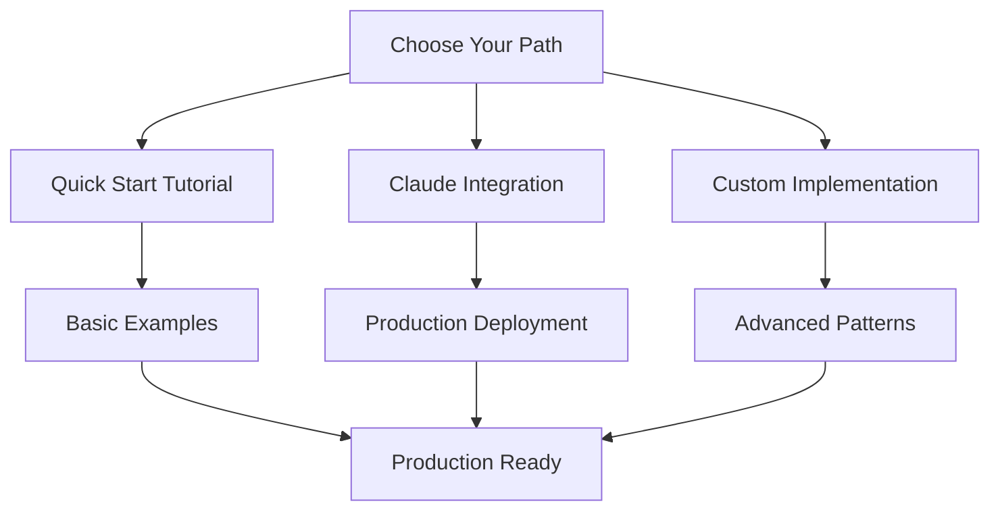

# AIRS MCP Usage Guide

## Overview

This comprehensive usage guide covers everything you need to know to integrate and use AIRS MCP in your applications, from quick start tutorials to advanced optimization patterns.

## Usage Patterns

AIRS MCP supports multiple usage patterns depending on your needs:

### **Quick Start & Basics**
- [Quick Start Guide](./usages/quick_start.md) - Get up and running in 5 minutes
- [Basic Examples](./usages/basic_examples.md) - Common integration patterns
- [Troubleshooting](./usages/troubleshooting.md) - Common issues and solutions

### **Production Integration** 
- [Claude Desktop Integration](./usages/claude_integration.md) - Complete Claude Desktop setup
- [OAuth2 Integration](./usages/oauth2_integration.md) - Enterprise authentication with MCP Inspector validation
- [Advanced Patterns](./usages/advanced_patterns.md) - High-performance implementations
- [Performance Optimization](./usages/performance_optimization.md) - Tuning for production

### **Advanced Usage**
- [Custom Transports](./usages/custom_transports.md) - Building custom transport layers
- [Migration Guide](./usages/migration_guide.md) - Upgrading and migration strategies

## When to Use AIRS MCP

**Choose AIRS MCP when you need:**
- ✅ **Production-grade MCP implementation** with Claude Desktop integration
- ✅ **Enterprise OAuth2 authentication** validated with MCP Inspector
- ✅ **High-performance JSON-RPC 2.0** with streaming and buffer optimization  
- ✅ **Type-safe Rust implementation** with comprehensive error handling
- ✅ **Bidirectional communication** for server-to-client requests
- ✅ **Real-time capabilities** with resource subscriptions and notifications

**Consider alternatives if:**
- ❌ You need a simple HTTP-only API (standard REST might be simpler)
- ❌ You're working in languages other than Rust (check MCP implementations in your language)
- ❌ You only need basic request-response patterns (lighter JSON-RPC libraries exist)

## Getting Started Workflow

## Support & Community

- **Documentation**: Complete API documentation with examples
- **Examples**: Production-ready server implementation
- **Testing**: Comprehensive test suite and validation tools
- **Performance**: Benchmarks and optimization guides
