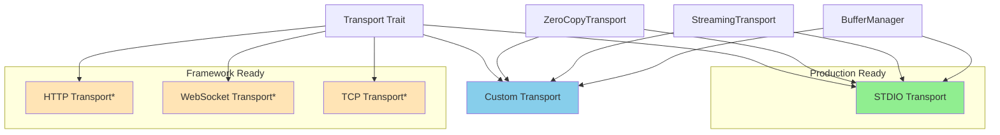

# Custom Transports

*Building custom transport layers and implementations*

Leverage the AIRS MCP transport abstraction layer to build custom transport implementations that suit your specific deployment requirements. Whether you need HTTP, WebSocket, TCP, or entirely custom protocols, this guide covers everything from basic implementation to production deployment.

## Transport Architecture Overview

The AIRS MCP transport system is built around a flexible trait-based architecture:



*\* Framework placeholders ready for implementation*

## Core Transport Trait

All transport implementations must satisfy the `Transport` trait:

```rust
use std::future::Future;
use airs_mcp::transport::{Transport, TransportError};

pub trait Transport: Send + Sync {
    /// Transport-specific error type
    type Error: std::error::Error + Send + Sync + 'static;

    /// Send a message through the transport
    fn send(&mut self, message: &[u8]) -> impl Future<Output = Result<(), Self::Error>> + Send;

    /// Receive a message from the transport
    fn receive(&mut self) -> impl Future<Output = Result<Vec<u8>, Self::Error>> + Send;

    /// Close the transport and clean up resources
    fn close(&mut self) -> impl Future<Output = Result<(), Self::Error>> + Send;
}
```

### Design Principles

- **Async-native**: All operations return futures for Tokio integration
- **Generic messages**: Uses raw bytes (`&[u8]`/`Vec<u8>`) for flexibility
- **Error transparency**: Associated Error type for transport-specific handling
- **Resource safety**: Explicit `close()` method ensures proper cleanup
- **Thread safety**: All implementations must be `Send + Sync`

## STDIO Transport Deep Dive

The production-ready STDIO transport serves as both the primary MCP transport and a reference implementation for custom transports.

### Message Framing

STDIO transport uses newline-delimited JSON for message framing:

```rust
use airs_mcp::transport::{Transport, StdioTransport};

async fn stdio_example() -> Result<(), Box<dyn std::error::Error>> {
    let mut transport = StdioTransportClientBuilder::new().await?;
    
    // Send JSON-RPC message (automatically adds newline)
    let request = br#"{"jsonrpc":"2.0","method":"ping","id":"1"}"#;
    transport.send(request).await?;
    
    // Receive response (newline automatically stripped)
    let response = transport.receive().await?;
    println!("Received: {}", String::from_utf8_lossy(&response));
    
    transport.close().await?;
    Ok(())
}
```

### Buffer Management

STDIO transport supports buffer pooling:

```rust
use airs_mcp::transport::{StdioTransport, BufferConfig};

async fn high_performance_stdio() -> Result<(), Box<dyn std::error::Error>> {
    // Configure buffer management
    let buffer_config = BufferConfig {
        read_buffer_capacity: 64 * 1024,     // 64KB read buffers
        write_buffer_capacity: 64 * 1024,    // 64KB write buffers
        max_message_size: 16 * 1024 * 1024,  // 16MB message limit
        pool_size: 10,                       // Pool 10 buffers
        acquire_timeout_ms: 100,             // 100ms timeout
        backpressure_threshold: 0.8,         // Apply backpressure at 80% capacity
    };
    
    let transport = StdioTransport::with_buffer_config(buffer_config).await?;
    
    // Monitor buffer performance
    if let Some(metrics) = transport.buffer_metrics() {
        println!("Buffer efficiency: {:.2}%", 
                 metrics.acquisition_success_rate() * 100.0);
    }
    
    Ok(())
}
```

### Buffer Management

Implement `ZeroCopyTransport` for maximum performance:

```rust
use airs_mcp::transport::{ZeroCopyTransport, TransportError};
use bytes::BytesMut;

async fn zero_copy_example<T: ZeroCopyTransport>(
    transport: &mut T
) -> Result<(), TransportError> {
    // Acquire buffer from pool
    let mut buffer = transport.acquire_buffer().await?;
    
    // Receive directly into buffer (no allocation)
    let bytes_received = transport.receive_into_buffer(&mut buffer).await?;
    
    // Process message in-place
    process_message_inplace(&mut buffer[..bytes_received]);
    
    // Send using efficient buffer operations
    transport.send_bytes(&buffer[..bytes_received]).await?;
    
    // Buffer automatically returned to pool when dropped
    Ok(())
}

fn process_message_inplace(buffer: &mut [u8]) {
    // Process message efficiently in-place
    // e.g., modify headers, add routing info, etc.
}
```

## Building Custom Transports

### Basic Custom Transport Template

Here's a template for implementing custom transports:

```rust
use std::sync::Arc;
use tokio::sync::Mutex;
use async_trait::async_trait;
use airs_mcp::transport::{Transport, TransportError};

/// Custom transport implementation
pub struct CustomTransport {
    // Your transport-specific state
    connection: Arc<Mutex<Option<Connection>>>,
    config: CustomConfig,
    closed: Arc<Mutex<bool>>,
}

#[derive(Debug)]
pub struct CustomConfig {
    pub endpoint: String,
    pub timeout_ms: u64,
    pub max_message_size: usize,
}

#[derive(Debug)]
struct Connection {
    // Your connection implementation
}

impl CustomTransport {
    pub async fn new(config: CustomConfig) -> Result<Self, TransportError> {
        Ok(Self {
            connection: Arc::new(Mutex::new(None)),
            config,
            closed: Arc::new(Mutex::new(false)),
        })
    }
    
    async fn ensure_connected(&self) -> Result<(), TransportError> {
        let mut conn = self.connection.lock().await;
        if conn.is_none() {
            *conn = Some(self.establish_connection().await?);
        }
        Ok(())
    }
    
    async fn establish_connection(&self) -> Result<Connection, TransportError> {
        // Implement your connection logic
        todo!("Implement connection establishment")
    }
}

impl Transport for CustomTransport {
    type Error = TransportError;

    async fn send(&mut self, message: &[u8]) -> Result<(), Self::Error> {
        // Check if closed
        if *self.closed.lock().await {
            return Err(TransportError::Closed);
        }
        
        // Validate message size
        if message.len() > self.config.max_message_size {
            return Err(TransportError::buffer_overflow(format!(
                "Message size {} exceeds limit {}",
                message.len(),
                self.config.max_message_size
            )));
        }
        
        // Ensure connection
        self.ensure_connected().await?;
        
        // Implement your send logic
        let connection = self.connection.lock().await;
        if let Some(conn) = connection.as_ref() {
            // Send message through your protocol
            self.send_through_connection(conn, message).await
        } else {
            Err(TransportError::connection_closed())
        }
    }

    async fn receive(&mut self) -> Result<Vec<u8>, Self::Error> {
        // Check if closed
        if *self.closed.lock().await {
            return Err(TransportError::Closed);
        }
        
        // Ensure connection
        self.ensure_connected().await?;
        
        // Implement your receive logic
        let connection = self.connection.lock().await;
        if let Some(conn) = connection.as_ref() {
            self.receive_from_connection(conn).await
        } else {
            Err(TransportError::connection_closed())
        }
    }

    async fn close(&mut self) -> Result<(), Self::Error> {
        // Set closed flag
        *self.closed.lock().await = true;
        
        // Close connection
        let mut connection = self.connection.lock().await;
        if let Some(conn) = connection.take() {
            self.close_connection(conn).await?;
        }
        
        Ok(())
    }
}

impl CustomTransport {
    async fn send_through_connection(
        &self,
        connection: &Connection,
        message: &[u8]
    ) -> Result<(), TransportError> {
        // Implement protocol-specific sending
        todo!("Implement protocol send")
    }
    
    async fn receive_from_connection(
        &self,
        connection: &Connection
    ) -> Result<Vec<u8>, TransportError> {
        // Implement protocol-specific receiving
        todo!("Implement protocol receive")
    }
    
    async fn close_connection(&self, connection: Connection) -> Result<(), TransportError> {
        // Implement connection cleanup
        todo!("Implement connection cleanup")
    }
}
```

### HTTP Transport Implementation

Here's a production-ready HTTP transport example:

```rust
use std::sync::Arc;
use tokio::sync::RwLock;
use reqwest::{Client, Url};
use serde_json::Value;
use airs_mcp::transport::{Transport, TransportError};

pub struct HttpTransport {
    client: Client,
    endpoint: Url,
    session_id: Arc<RwLock<Option<String>>>,
    last_event_id: Arc<RwLock<Option<String>>>,
    timeout: std::time::Duration,
}

impl HttpTransport {
    pub fn new(endpoint: Url, timeout_ms: u64) -> Result<Self, TransportError> {
        let client = Client::builder()
            .timeout(std::time::Duration::from_millis(timeout_ms))
            .build()
            .map_err(|e| TransportError::format(format!("HTTP client error: {}", e)))?;
            
        Ok(Self {
            client,
            endpoint,
            session_id: Arc::new(RwLock::new(None)),
            last_event_id: Arc::new(RwLock::new(None)),
            timeout: std::time::Duration::from_millis(timeout_ms),
        })
    }
}

impl Transport for HttpTransport {
    type Error = TransportError;

    async fn send(&mut self, message: &[u8]) -> Result<(), Self::Error> {
        let json: Value = serde_json::from_slice(message)
            .map_err(|e| TransportError::format(format!("Invalid JSON: {}", e)))?;
            
        let response = self.client
            .post(self.endpoint.clone())
            .json(&json)
            .header("Content-Type", "application/json")
            .send()
            .await
            .map_err(|e| TransportError::io(e))?;
            
        if !response.status().is_success() {
            return Err(TransportError::format(format!(
                "HTTP error: {}", response.status()
            )));
        }
        
        Ok(())
    }

    async fn receive(&mut self) -> Result<Vec<u8>, Self::Error> {
        // For HTTP, you might implement Server-Sent Events or polling
        // This is a simplified example
        let response = self.client
            .get(self.endpoint.clone())
            .send()
            .await
            .map_err(|e| TransportError::io(e))?;
            
        let bytes = response.bytes().await
            .map_err(|e| TransportError::io(e))?;
            
        Ok(bytes.to_vec())
    }

    async fn close(&mut self) -> Result<(), Self::Error> {
        // HTTP is stateless, so just clear session state
        *self.session_id.write().await = None;
        *self.last_event_id.write().await = None;
        Ok(())
    }
}
```

### WebSocket Transport Implementation

For real-time bidirectional communication:

```rust
use tokio_tungstenite::{connect_async, WebSocketStream, MaybeTlsStream};
use tokio::net::TcpStream;
use tokio_tungstenite::tungstenite::Message;
use std::sync::Arc;
use tokio::sync::Mutex;
use airs_mcp::transport::{Transport, TransportError};

pub struct WebSocketTransport {
    ws_stream: Arc<Mutex<Option<WebSocketStream<MaybeTlsStream<TcpStream>>>>>,
    url: String,
    closed: Arc<Mutex<bool>>,
}

impl WebSocketTransport {
    pub async fn new(url: String) -> Result<Self, TransportError> {
        let transport = Self {
            ws_stream: Arc::new(Mutex::new(None)),
            url,
            closed: Arc::new(Mutex::new(false)),
        };
        
        transport.connect().await?;
        Ok(transport)
    }
    
    async fn connect(&self) -> Result<(), TransportError> {
        let (ws_stream, _) = connect_async(&self.url).await
            .map_err(|e| TransportError::io(e))?;
            
        *self.ws_stream.lock().await = Some(ws_stream);
        Ok(())
    }
}

impl Transport for WebSocketTransport {
    type Error = TransportError;

    async fn send(&mut self, message: &[u8]) -> Result<(), Self::Error> {
        if *self.closed.lock().await {
            return Err(TransportError::Closed);
        }
        
        let mut stream_guard = self.ws_stream.lock().await;
        if let Some(stream) = stream_guard.as_mut() {
            use futures_util::SinkExt;
            
            let text = String::from_utf8(message.to_vec())
                .map_err(|e| TransportError::format(format!("Invalid UTF-8: {}", e)))?;
                
            stream.send(Message::Text(text)).await
                .map_err(|e| TransportError::io(e))?;
        } else {
            return Err(TransportError::connection_closed());
        }
        
        Ok(())
    }

    async fn receive(&mut self) -> Result<Vec<u8>, Self::Error> {
        if *self.closed.lock().await {
            return Err(TransportError::Closed);
        }
        
        let mut stream_guard = self.ws_stream.lock().await;
        if let Some(stream) = stream_guard.as_mut() {
            use futures_util::StreamExt;
            
            if let Some(msg) = stream.next().await {
                let msg = msg.map_err(|e| TransportError::io(e))?;
                
                match msg {
                    Message::Text(text) => Ok(text.into_bytes()),
                    Message::Binary(data) => Ok(data),
                    Message::Close(_) => {
                        *self.closed.lock().await = true;
                        Err(TransportError::Closed)
                    }
                    _ => Err(TransportError::format("Unexpected message type".to_string())),
                }
            } else {
                Err(TransportError::Closed)
            }
        } else {
            Err(TransportError::connection_closed())
        }
    }

    async fn close(&mut self) -> Result<(), Self::Error> {
        *self.closed.lock().await = true;
        
        let mut stream_guard = self.ws_stream.lock().await;
        if let Some(mut stream) = stream_guard.take() {
            use futures_util::SinkExt;
            let _ = stream.close(None).await; // Best effort close
        }
        
        Ok(())
    }
}
```

## Protocol Considerations

### Message Framing

Different transport protocols require different message framing strategies:

| Transport | Framing Strategy | Example |
|-----------|------------------|---------|
| STDIO | Newline-delimited | `{"jsonrpc":"2.0","method":"ping"}\n` |
| HTTP | Content-Length header | `Content-Length: 35\r\n\r\n{"jsonrpc":"2.0","method":"ping"}` |
| WebSocket | Native framing | WebSocket text/binary frames |
| TCP | Length-prefixed | `[4-byte length][JSON payload]` |

### Error Handling Strategies

Implement robust error handling for network failures:

```rust
use airs_mcp::transport::TransportError;

#[derive(Debug, thiserror::Error)]
pub enum CustomTransportError {
    #[error("Connection timeout")]
    Timeout,
    
    #[error("Protocol violation: {0}")]
    ProtocolViolation(String),
    
    #[error("Authentication failed")]
    AuthenticationFailed,
    
    #[error("Rate limit exceeded")]
    RateLimitExceeded,
    
    #[error("Network error: {0}")]
    Network(#[from] std::io::Error),
}

impl From<CustomTransportError> for TransportError {
    fn from(err: CustomTransportError) -> Self {
        match err {
            CustomTransportError::Timeout => TransportError::timeout(),
            CustomTransportError::Network(io_err) => TransportError::io(io_err),
            other => TransportError::format(other.to_string()),
        }
    }
}
```

### Security Implementation

Implement security features for production deployments:

```rust
use std::sync::Arc;
use tokio_rustls::{TlsConnector, rustls::ClientConfig};

pub struct SecureTransport<T> {
    inner: T,
    tls_config: Arc<ClientConfig>,
    certificate_validation: bool,
}

impl<T: Transport> SecureTransport<T> {
    pub fn new(inner: T, tls_config: ClientConfig) -> Self {
        Self {
            inner,
            tls_config: Arc::new(tls_config),
            certificate_validation: true,
        }
    }
    
    pub fn disable_certificate_validation(mut self) -> Self {
        self.certificate_validation = false;
        self
    }
}

impl<T: Transport> Transport for SecureTransport<T> {
    type Error = TransportError;

    async fn send(&mut self, message: &[u8]) -> Result<(), Self::Error> {
        // Add authentication headers or encryption
        let encrypted_message = self.encrypt_message(message)?;
        self.inner.send(&encrypted_message).await
            .map_err(|e| TransportError::format(e.to_string()))
    }

    async fn receive(&mut self) -> Result<Vec<u8>, Self::Error> {
        let encrypted_message = self.inner.receive().await
            .map_err(|e| TransportError::format(e.to_string()))?;
        self.decrypt_message(&encrypted_message)
    }

    async fn close(&mut self) -> Result<(), Self::Error> {
        self.inner.close().await
            .map_err(|e| TransportError::format(e.to_string()))
    }
}

impl<T> SecureTransport<T> {
    fn encrypt_message(&self, message: &[u8]) -> Result<Vec<u8>, TransportError> {
        // Implement encryption
        Ok(message.to_vec()) // Placeholder
    }
    
    fn decrypt_message(&self, message: &[u8]) -> Result<Vec<u8>, TransportError> {
        // Implement decryption
        Ok(message.to_vec()) // Placeholder
    }
}
```

## Performance Optimization

### Buffer Management Integration

Integrate with AIRS MCP's buffer management:

```rust
use airs_mcp::transport::buffer::{BufferManager, BufferConfig};
use std::sync::Arc;

pub struct BufferedTransport<T> {
    inner: T,
    buffer_manager: Arc<BufferManager>,
}

impl<T: Transport> BufferedTransport<T> {
    pub fn new(inner: T, buffer_config: BufferConfig) -> Self {
        Self {
            inner,
            buffer_manager: Arc::new(BufferManager::new(buffer_config)),
        }
    }
}

impl<T: Transport> Transport for BufferedTransport<T> {
    type Error = TransportError;

    async fn send(&mut self, message: &[u8]) -> Result<(), Self::Error> {
        // Use buffer pool for send operations
        let mut buffer = self.buffer_manager.acquire_write_buffer().await?;
        buffer.extend_from_slice(message);
        
        self.inner.send(&buffer).await
            .map_err(|e| TransportError::format(e.to_string()))
        // Buffer automatically returned to pool when dropped
    }

    async fn receive(&mut self) -> Result<Vec<u8>, Self::Error> {
        let message = self.inner.receive().await
            .map_err(|e| TransportError::format(e.to_string()))?;
            
        // Process with buffer pool to reduce allocations
        let mut buffer = self.buffer_manager.acquire_read_buffer().await?;
        buffer.clear();
        buffer.extend_from_slice(&message);
        
        Ok(buffer.to_vec())
    }

    async fn close(&mut self) -> Result<(), Self::Error> {
        self.inner.close().await
            .map_err(|e| TransportError::format(e.to_string()))
    }
}
```

### Streaming Integration

Leverage streaming capabilities for large messages:

```rust
use airs_mcp::transport::streaming::{StreamingTransport, StreamingStats};
use airs_mcp::protocol::jsonrpc::streaming::StreamingConfig;

async fn create_streaming_transport<T>(
    base_transport: T,
    max_message_size: usize
) -> StreamingTransport<T>
where
    T: Transport + airs_mcp::transport::ZeroCopyTransport + Send + Sync,
{
    let config = StreamingConfig {
        max_message_size,
        read_buffer_size: 256 * 1024,  // 256KB streaming buffer
        strict_validation: true,
    };
    
    StreamingTransport::new(base_transport, config)
}
```

## Testing Custom Transports

### Mock Transport for Testing

Create mock transports for comprehensive testing:

```rust
use std::collections::VecDeque;
use std::sync::Arc;
use tokio::sync::Mutex;
use airs_mcp::transport::{Transport, TransportError};

pub struct MockTransport {
    messages: Arc<Mutex<Vec<Vec<u8>>>>,
    responses: Arc<Mutex<VecDeque<Vec<u8>>>>,
    closed: Arc<Mutex<bool>>,
}

impl MockTransport {
    pub fn new() -> Self {
        Self {
            messages: Arc::new(Mutex::new(Vec::new())),
            responses: Arc::new(Mutex::new(VecDeque::new())),
            closed: Arc::new(Mutex::new(false)),
        }
    }
    
    pub async fn add_response(&self, response: Vec<u8>) {
        self.responses.lock().await.push_back(response);
    }
    
    pub async fn get_sent_messages(&self) -> Vec<Vec<u8>> {
        self.messages.lock().await.clone()
    }
}

impl Transport for MockTransport {
    type Error = TransportError;

    async fn send(&mut self, message: &[u8]) -> Result<(), Self::Error> {
        if *self.closed.lock().await {
            return Err(TransportError::Closed);
        }
        
        self.messages.lock().await.push(message.to_vec());
        Ok(())
    }

    async fn receive(&mut self) -> Result<Vec<u8>, Self::Error> {
        if *self.closed.lock().await {
            return Err(TransportError::Closed);
        }
        
        let mut responses = self.responses.lock().await;
        responses.pop_front()
            .ok_or_else(|| TransportError::format("No response available".to_string()))
    }

    async fn close(&mut self) -> Result<(), Self::Error> {
        *self.closed.lock().await = true;
        Ok(())
    }
}

#[cfg(test)]
mod tests {
    use super::*;

    #[tokio::test]
    async fn test_mock_transport() {
        let mut transport = MockTransport::new();
        
        // Add response
        transport.add_response(b"test response".to_vec()).await;
        
        // Test send
        transport.send(b"test message").await.unwrap();
        
        // Test receive
        let response = transport.receive().await.unwrap();
        assert_eq!(response, b"test response");
        
        // Verify sent messages
        let sent = transport.get_sent_messages().await;
        assert_eq!(sent.len(), 1);
        assert_eq!(sent[0], b"test message");
    }
}
```

### Integration Testing

Test transport integration with the MCP protocol:

```rust
use airs_mcp::integration::server::JsonRpcServer;
use airs_mcp::protocol::jsonrpc::message::*;

#[tokio::test]
async fn test_custom_transport_integration() {
    let transport = CustomTransport::new(CustomConfig {
        endpoint: "ws://localhost:8080".to_string(),
        timeout_ms: 5000,
        max_message_size: 1024 * 1024,
    }).await.unwrap();
    
    let server = JsonRpcServer::new(transport).await.unwrap();
    
    // Test request handling
    let request_handler = |req: JsonRpcRequest| async move {
        JsonRpcResponse::success(req.id, serde_json::Value::String("pong".to_string()))
    };
    
    let notification_handler = |_notif: JsonRpcNotification| async {
        // Handle notification
    };
    
    // Run server with custom transport
    server.run(request_handler, notification_handler).await.unwrap();
}
```

## Production Deployment

### Configuration Management

Structure configuration for production deployments:

```rust
use serde::{Deserialize, Serialize};

#[derive(Debug, Clone, Serialize, Deserialize)]
pub struct TransportConfig {
    pub transport_type: TransportType,
    pub stdio: Option<StdioConfig>,
    pub http: Option<HttpConfig>,
    pub websocket: Option<WebSocketConfig>,
    pub custom: Option<CustomConfig>,
}

#[derive(Debug, Clone, Serialize, Deserialize)]
pub enum TransportType {
    Stdio,
    Http,
    WebSocket,
    Custom(String),
}

#[derive(Debug, Clone, Serialize, Deserialize)]
pub struct StdioConfig {
    pub max_message_size: usize,
    pub buffer_pool_size: Option<usize>,
    pub enable_buffers: bool,
}

#[derive(Debug, Clone, Serialize, Deserialize)]
pub struct HttpConfig {
    pub endpoint: String,
    pub timeout_ms: u64,
    pub max_retries: u32,
    pub enable_tls: bool,
    pub certificate_path: Option<String>,
}

pub async fn create_transport_from_config(
    config: &TransportConfig
) -> Result<Box<dyn Transport<Error = TransportError>>, TransportError> {
    match config.transport_type {
        TransportType::Stdio => {
            let stdio_config = config.stdio.as_ref()
                .ok_or_else(|| TransportError::format("Missing STDIO config".to_string()))?;
                
            if stdio_config.enable_buffers {
                let buffer_config = BufferConfig {
                    pool_size: stdio_config.buffer_pool_size.unwrap_or(10),
                    max_message_size: stdio_config.max_message_size,
                    ..Default::default()
                };
                Ok(Box::new(StdioTransport::with_buffer_config(buffer_config).await?))
            } else {
                Ok(Box::new(StdioTransport::with_max_message_size(
                    stdio_config.max_message_size
                ).await?))
            }
        }
        TransportType::Http => {
            let http_config = config.http.as_ref()
                .ok_or_else(|| TransportError::format("Missing HTTP config".to_string()))?;
                
            let endpoint = http_config.endpoint.parse()
                .map_err(|e| TransportError::format(format!("Invalid endpoint: {}", e)))?;
                
            Ok(Box::new(HttpTransport::new(endpoint, http_config.timeout_ms)?))
        }
        TransportType::WebSocket => {
            let ws_config = config.websocket.as_ref()
                .ok_or_else(|| TransportError::format("Missing WebSocket config".to_string()))?;
                
            Ok(Box::new(WebSocketTransport::new(ws_config.url.clone()).await?))
        }
        TransportType::Custom(name) => {
            // Load custom transport by name
            Err(TransportError::format(format!("Custom transport '{}' not implemented", name)))
        }
    }
}
```

### Monitoring and Metrics

Implement comprehensive monitoring:

```rust
use std::sync::atomic::{AtomicU64, Ordering};
use std::time::Instant;

pub struct TransportMetrics {
    pub messages_sent: AtomicU64,
    pub messages_received: AtomicU64,
    pub bytes_sent: AtomicU64,
    pub bytes_received: AtomicU64,
    pub errors: AtomicU64,
    pub connection_count: AtomicU64,
}

impl TransportMetrics {
    pub fn new() -> Self {
        Self {
            messages_sent: AtomicU64::new(0),
            messages_received: AtomicU64::new(0),
            bytes_sent: AtomicU64::new(0),
            bytes_received: AtomicU64::new(0),
            errors: AtomicU64::new(0),
            connection_count: AtomicU64::new(0),
        }
    }
    
    pub fn record_send(&self, byte_count: usize) {
        self.messages_sent.fetch_add(1, Ordering::Relaxed);
        self.bytes_sent.fetch_add(byte_count as u64, Ordering::Relaxed);
    }
    
    pub fn record_receive(&self, byte_count: usize) {
        self.messages_received.fetch_add(1, Ordering::Relaxed);
        self.bytes_received.fetch_add(byte_count as u64, Ordering::Relaxed);
    }
    
    pub fn record_error(&self) {
        self.errors.fetch_add(1, Ordering::Relaxed);
    }
}

pub struct MonitoredTransport<T> {
    inner: T,
    metrics: Arc<TransportMetrics>,
}

impl<T: Transport> Transport for MonitoredTransport<T> {
    type Error = TransportError;

    async fn send(&mut self, message: &[u8]) -> Result<(), Self::Error> {
        let start = Instant::now();
        
        match self.inner.send(message).await {
            Ok(()) => {
                self.metrics.record_send(message.len());
                Ok(())
            }
            Err(e) => {
                self.metrics.record_error();
                Err(TransportError::format(e.to_string()))
            }
        }
    }

    async fn receive(&mut self) -> Result<Vec<u8>, Self::Error> {
        match self.inner.receive().await {
            Ok(message) => {
                self.metrics.record_receive(message.len());
                Ok(message)
            }
            Err(e) => {
                self.metrics.record_error();
                Err(TransportError::format(e.to_string()))
            }
        }
    }

    async fn close(&mut self) -> Result<(), Self::Error> {
        self.inner.close().await
            .map_err(|e| TransportError::format(e.to_string()))
    }
}
```

## Next Steps

With custom transport implementation complete, you're ready to:

1. **[Patterns →](advanced_patterns.md)** - Explore patterns and techniques

Transport flexibility is one of AIRS MCP's key strengths. Whether you need simple STDIO communication or complex multi-protocol routing, the transport abstraction layer provides the foundation for any deployment scenario.
