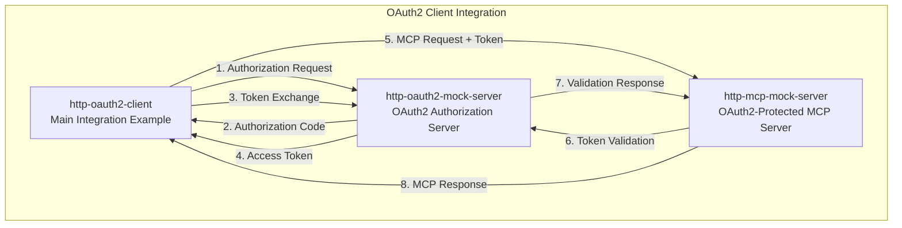
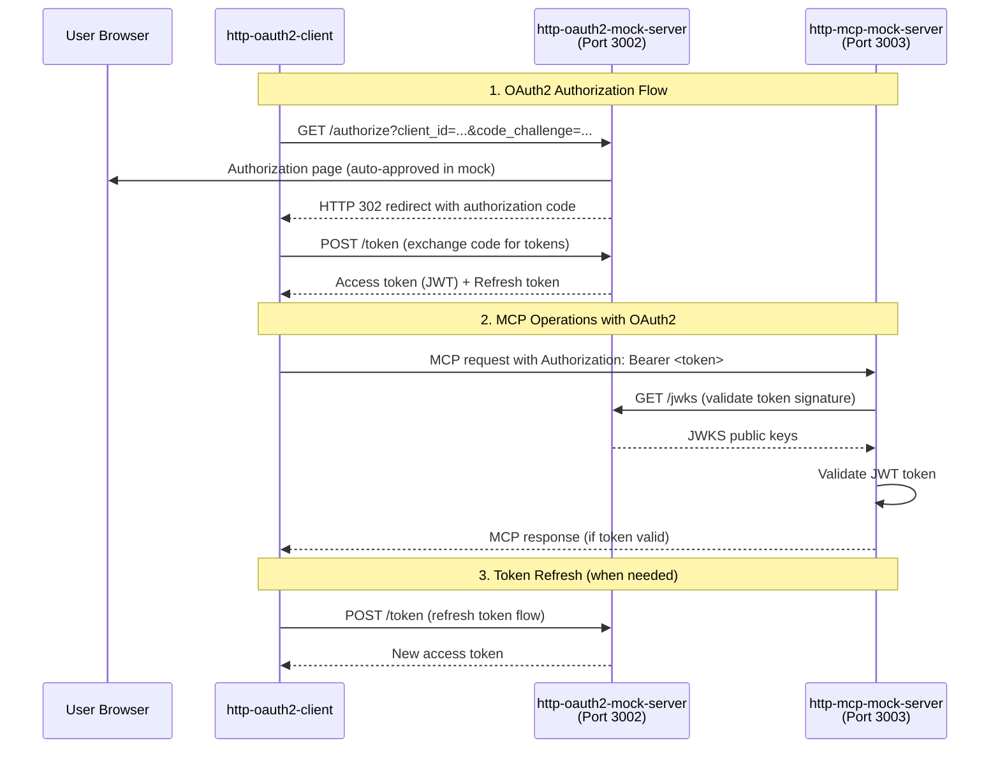

# HTTP OAuth2 Client Integration Example

A comprehensive example demonstrating how to use AIRS MCP as an OAuth2-authenticated HTTP client, including complete OAuth2 authorization code flow with PKCE support.

## Architecture Overview

This example consists of **three separate binaries** that work together to demonstrate a complete OAuth2 + MCP integration scenario:



## Why Three Binaries?

### 1. `http-oauth2-client` - The Core Integration Example

**Purpose**: Demonstrates how to use AIRS MCP library with OAuth2 authentication.

**Key Features**:
- Complete OAuth2 authorization code flow with PKCE
- Token management (access tokens, refresh tokens)
- MCP operations against OAuth2-protected servers
- Error handling and retry logic
- Educational example for developers

**Why Essential**: This is the primary demonstration of OAuth2 + MCP integration that developers will study and adapt.

### 2. `http-oauth2-mock-server` - OAuth2 Authorization Server

**Purpose**: Simulates a real OAuth2 provider (like Google, GitHub, Auth0) for testing and development.

**Key Features**:
- OAuth2 endpoints: `/authorize`, `/token`, `/jwks`
- Authorization code flow with PKCE support
- JWT access token generation and validation
- Client credential validation
- Redirect URI validation
- Proper OAuth2 error responses

**Why Essential**:
- **Testing Independence**: No dependency on external OAuth2 providers
- **Development Environment**: Works offline without internet connectivity
- **Complete Flow Testing**: Enables testing the full authorization flow locally
- **Error Simulation**: Can simulate various OAuth2 error conditions for robust testing

### 3. `http-mcp-mock-server` - OAuth2-Protected MCP Server

**Purpose**: Provides an MCP server that requires OAuth2 authentication to access its resources and tools.

**Key Features**:
- MCP protocol implementation with OAuth2 token validation
- JWT token verification using JWKS from authorization server
- Protected MCP resources (files, tools, etc.)
- OAuth2 error responses for invalid/expired tokens
- Demonstrates secure MCP server patterns

**Why Essential**:
- **End-to-End Testing**: The client needs an OAuth2-protected target to connect to
- **Security Demonstration**: Shows how MCP servers validate OAuth2 tokens
- **Integration Validation**: Proves the complete OAuth2 + MCP flow works
- **Real-World Simulation**: Mimics production scenarios where MCP servers require authentication

## OAuth2 Flow Sequence



## Comparison with API Key Authentication

| Aspect | API Key Example | OAuth2 Example |
|--------|----------------|----------------|
| **Binaries** | 2 (client + MCP server) | 3 (client + OAuth2 server + MCP server) |
| **Authentication** | Simple API key in header | OAuth2 authorization code flow |
| **Token Management** | Static API key | Dynamic JWT tokens with expiration |
| **Security** | Pre-shared secret | Cryptographic signatures, PKCE |
| **Complexity** | Low | High (realistic for production) |
| **Use Case** | Simple API access | Enterprise authentication integration |

## Directory Structure

```
http-oauth2-client-integration/
├── Cargo.toml                    # Three binary definitions
├── README.md                     # This documentation
├── .gitignore                    # Git ignore file (excludes keys, venv)
├── scripts/                      # Setup and utility scripts
│   ├── README.md                # Scripts documentation
│   ├── setup_keys.sh            # Shell script for key generation
│   └── setup_keys.py            # Python script for key generation
├── config/                       # Configuration files
│   ├── client_config.toml        # OAuth2 client configuration
│   ├── auth_server_config.toml   # OAuth2 server configuration
│   └── mcp_server_config.toml    # MCP server configuration
├── src/
│   ├── main.rs                   # http-oauth2-client binary
│   ├── lib.rs                    # Shared utilities and types
│   ├── oauth2/                   # OAuth2 client implementation
│   │   ├── mod.rs
│   │   ├── flow.rs              # Authorization code flow
│   │   ├── pkce.rs              # PKCE implementation
│   │   └── tokens.rs            # Token management
│   ├── mock_oauth2_server/       # OAuth2 authorization server
│   │   ├── main.rs              # Server binary entry point
│   │   ├── mod.rs
│   │   ├── endpoints.rs         # OAuth2 endpoints
│   │   ├── tokens.rs            # JWT token generation
│   │   └── jwks.rs              # JWKS endpoint
│   └── mock_mcp_server/          # OAuth2-protected MCP server
│       ├── main.rs              # Server binary entry point
│       ├── mod.rs
│       ├── auth.rs              # OAuth2 token validation
│       ├── handlers.rs          # MCP protocol handlers
│       └── resources.rs         # Mock MCP resources
├── tests/                        # Python integration tests
│   ├── test_oauth2_flow.py      # OAuth2 flow testing
│   ├── test_mcp_integration.py  # End-to-end MCP testing
│   └── test_security.py         # Security validation tests
└── docs/                         # Additional documentation
    ├── OAUTH2_FLOW.md           # Detailed OAuth2 flow explanation
    ├── SECURITY.md              # Security considerations
    └── INTEGRATION.md           # Integration patterns
```

## Quick Start

### 1. Generate Cryptographic Keys

First, generate the RSA keys needed for JWT signing:

```bash
# Option 1: Using shell script (macOS/Linux)
./scripts/setup_keys.sh

# Option 2: Using Python script (cross-platform)
python3 scripts/setup_keys.py
```

### 2. Build All Binaries

```bash
cargo build --workspace
```

### 3. Start the OAuth2 Authorization Server

```bash
cargo run --bin http-oauth2-mock-server
# Starts on http://localhost:3002
```

### 4. Start the OAuth2-Protected MCP Server

```bash
cargo run --bin http-mcp-mock-server
# Starts on http://localhost:3003
```

### 5. Run the OAuth2 Client

```bash
cargo run --bin http-oauth2-client
# Performs OAuth2 flow and MCP operations
```

### 5. Run Integration Tests

```bash
# Install Python dependencies
python -m venv venv
source venv/bin/activate  # On Windows: venv\Scripts\activate
pip install -r requirements.txt

# Run tests
pytest tests/ -v
```

## Edge Case Testing Strategy

### Client-Side OAuth2 Edge Case Testing (Secondary Focus)

This example provides **client-side edge case testing** to complement the server-side testing in `http-oauth2-server-integration`. The focus here is on **client resilience and end-to-end flow robustness**.

#### **Why This Example for Client-Side Testing?**
- ✅ **Complete OAuth2 Flow**: Tests full authorization code flow with PKCE
- ✅ **Mock Server Control**: Can simulate various server error conditions  
- ✅ **Client Resilience**: Tests how AIRS MCP client handles OAuth2 server problems
- ✅ **Integration Testing**: Validates end-to-end client behavior under stress
- ✅ **Flow Interruption**: Tests authorization flow edge cases and recovery

#### **Edge Case Coverage Areas**

**1. Authorization Flow Edge Cases**
- Network failures during authorization request
- Authorization flow interruption (browser closed, timeout)
- Malformed authorization server responses
- Authorization server downtime scenarios
- Invalid redirect URI handling by client

**2. Token Management Edge Cases**
- Token refresh failures and fallback behavior
- Expired token detection and automatic refresh
- Corrupted token storage and recovery
- Token revocation scenarios
- Multiple concurrent token refresh attempts

**3. MCP Integration Resilience**
- MCP operations with expired tokens (automatic refresh)
- Network timeouts during token-protected MCP calls
- MCP server authentication failures
- Graceful degradation when OAuth2 is unavailable
- Error propagation from OAuth2 to MCP layer

**4. Client Configuration Edge Cases**
- Invalid OAuth2 server configuration
- Missing client credentials handling
- Malformed JWKS endpoint responses
- SSL/TLS certificate validation failures
- OAuth2 server endpoint discovery failures

#### **Test Implementation Location**
- **Primary**: `tests/test_oauth2_edge_cases.py` (to be implemented)  
- **Integration**: Extends existing `test_oauth2_flow.py` and `test_oauth2_integration.py`
- **Coverage**: ~15-20 client-focused edge case tests

For **server-side OAuth2 edge cases** (middleware validation, security attacks, JWT validation), see the `http-oauth2-server-integration` example which tests actual AIRS MCP OAuth2 middleware.

## Key Learning Points

1. **OAuth2 Complexity**: OAuth2 requires multiple components working together
2. **Security by Design**: JWT tokens, PKCE, and proper validation patterns
3. **Real-World Architecture**: Separation of authorization and resource servers
4. **Token Lifecycle**: Access token generation, validation, and refresh
5. **Error Handling**: Proper OAuth2 error responses and client handling
6. **Testing Strategy**: Complete flow testing with mock services

## Production Considerations

- **Token Storage**: Secure token storage (not demonstrated in this example)
- **HTTPS**: All OAuth2 flows must use HTTPS in production
- **Client Secrets**: Proper client credential management
- **Scope Management**: Fine-grained permission scopes
- **Rate Limiting**: Protection against abuse
- **Logging**: Comprehensive audit trails

## Related Examples

- [`http-apikey-client-integration`](../http-apikey-client-integration/) - Simpler API key authentication
- [`http-oauth2-server-integration`](../http-oauth2-server-integration/) - OAuth2 server implementation reference
- [`stdio-client-integration`](../stdio-client-integration/) - STDIO transport client

---

This example provides a complete, production-realistic demonstration of OAuth2 + MCP integration that developers can understand, test, and adapt for their own authentication requirements.