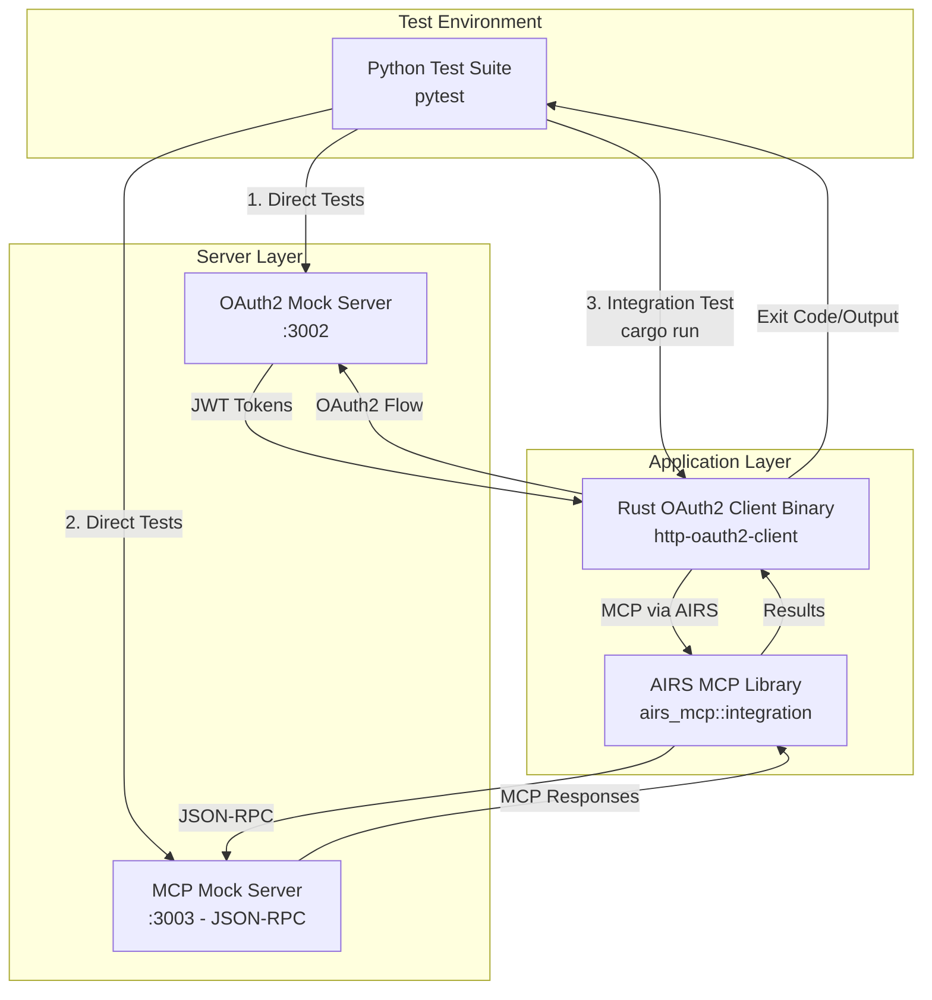

# HTTP OAuth2 Client Integration Tests

This directory contains comprehensive integration tests for the HTTP OAuth2 MCP client example.

## Test Architecture Overview

Our test suite uses a **multi-tier testing approach** to validate the complete OAuth2 + MCP integration:



## Test Types

### 1. **Direct Server Tests** 
Tests that directly hit server endpoints (bypassing the client):

- **`test_servers_health`**: Direct health checks to both servers
- **`test_mcp_server_configuration`**: Direct JSON-RPC calls to MCP server 
  
*Purpose*: Validate server functionality in isolation

### 2. **Integration Tests**
Tests that run the complete flow through our Rust client:

- **`test_oauth2_client_integration`**: Executes the actual `http-oauth2-client` binary
  
*Purpose*: Validate the entire OAuth2 → MCP workflow as users would experience it

## Key Components

### OAuth2 Flow (Three-Binary Architecture)
1. **OAuth2 Client** (`http-oauth2-client`) - Our main integration client
2. **OAuth2 Server** (`http-oauth2-mock-server`) - Mock authorization server 
3. **MCP Server** (`http-mcp-mock-server`) - Mock MCP server with OAuth2 protection

### Protocol Standards
- **OAuth2**: Standard authorization code flow with PKCE
- **MCP**: JSON-RPC 2.0 over HTTP (single endpoint: `/`)
- **AIRS MCP**: Uses `airs_mcp::integration` library for proper MCP client implementation

## Quick Start

Run all tests with the provided script:

```bash
./tests/run_tests.sh
```

This script will:
1. Create a Python virtual environment (`tests/venv/`)
2. Install required dependencies
3. Build all required binaries (client, OAuth2 server, MCP server)
4. Run the comprehensive test suite

## Manual Testing Setup

If you prefer manual setup:

```bash
# Create virtual environment
python3 -m venv tests/venv
source tests/venv/bin/activate

# Install dependencies
pip install -r tests/requirements.txt

# Run tests
pytest tests/ -v
```

## Test Structure & Flow

### `test_oauth2_basic.py` - Server Validation
**Type**: Direct server tests  
**Purpose**: Validate individual server functionality

Tests:
- Authorization URL generation
- OAuth2 authorization endpoint validation  
- Token endpoint functionality
- JWKS endpoint compliance
- Error handling for invalid requests

**Flow**: `Python Test → OAuth2 Server (direct)`

### `test_oauth2_integration.py` - Complete Integration
**Type**: End-to-end integration tests  
**Purpose**: Validate the complete user workflow

#### Test 1: `test_servers_health`
**Flow**: `Python Test → Server Health Endpoints (direct)`
- Direct health checks to both OAuth2 and MCP servers
- Validates server startup and basic connectivity

#### Test 2: `test_mcp_server_configuration` 
**Flow**: `Python Test → MCP Server JSON-RPC (direct)`
- Direct JSON-RPC calls to MCP server `/` endpoint
- Validates OAuth2 authentication on MCP server
- Tests proper 401 Unauthorized responses

#### Test 3: `test_oauth2_client_integration` ⭐ **MAIN TEST**
**Flow**: `Python Test → Rust Client Binary → OAuth2 Server + MCP Server`

This is the **complete integration test** that simulates real user workflow:

```bash
# Python test executes:
cargo run --bin http-oauth2-client -- \
  --auth-server http://127.0.0.1:3002 \
  --mcp-server http://127.0.0.1:3003
```

**Step-by-step flow:**
1. **Python Test** starts OAuth2 & MCP servers
2. **Python Test** executes Rust client binary via `cargo run`
3. **Rust Client** initiates OAuth2 authorization flow
4. **Rust Client** receives OAuth2 authorization code  
5. **Rust Client** exchanges code for JWT access token
6. **Rust Client** creates MCP session using `airs_mcp::integration`
7. **AIRS MCP Library** sends JSON-RPC requests to MCP server with OAuth2 token
8. **MCP Server** validates JWT token and responds
9. **Rust Client** executes MCP operations (tools/list, resources/list, tools/call)
10. **Rust Client** completes and returns results to Python test

**What this validates:**
- ✅ Complete OAuth2 authorization code flow with PKCE
- ✅ JWT token generation and validation  
- ✅ MCP protocol implementation via AIRS library
- ✅ OAuth2 authentication on MCP operations
- ✅ JSON-RPC 2.0 compliance
- ✅ Error handling and edge cases
- ✅ Real-world integration as users would experience
- Authorization code exchange
- Token validation
- Basic error scenarios

### `test_oauth2_integration.py`
Complete OAuth2 + MCP integration:
- End-to-end OAuth2 flow
- MCP operations with OAuth2 tokens
- Server communication validation
- Authentication middleware testing

### `test_oauth2_comprehensive.py`
Advanced OAuth2 scenarios:
- Token refresh flows
- Expired token handling
- Scope validation
- PKCE challenge verification
- Concurrent authentication requests

### `test_server_management.py`
Server lifecycle and configuration:
- OAuth2 server startup/shutdown
## Debugging & Troubleshooting

### Common Issues

#### 1. **401 Unauthorized in MCP Session**
```
Error: NetworkError { message: "Failed to initialize MCP session: Custom error: Transport error: Protocol error: HTTP error 401: Unauthorized" }
```

**Cause**: OAuth2 token validation failing on MCP server  
**Debug**:
- Check if demo authorization codes are pre-stored in OAuth2 server
- Verify JWT token format and claims
- Ensure MCP server JWKS URL matches OAuth2 server

#### 2. **404 Not Found**  
```
Error: HTTP error 404: Not Found
```

**Cause**: AIRS MCP client trying wrong endpoint  
**Solutions**:
- Ensure MCP server implements JSON-RPC on `/` endpoint
- Verify MCP server is using single endpoint, not REST-style routes
- Check server startup logs for available endpoints

#### 3. **Connection Refused**
```
Error: Connection refused
```

**Cause**: Server not running or port conflicts  
**Debug**:
- Check if servers started successfully: `curl http://localhost:3002/health`
- Verify ports 3002 (OAuth2) and 3003 (MCP) are available
- Check server logs for startup errors

### Debug Commands

#### Standard Testing
```bash
# Test OAuth2 server directly
curl http://localhost:3002/health
curl http://localhost:3002/.well-known/openid_configuration

# Test MCP server directly (requires valid JWT)
curl -X POST http://localhost:3003/ \
  -H "Content-Type: application/json" \
  -H "Authorization: Bearer <jwt_token>" \
  -d '{"jsonrpc":"2.0","id":1,"method":"initialize","params":{}}'

# Run single test with verbose output
pytest tests/test_oauth2_integration.py::TestOAuth2Integration::test_oauth2_client_integration -v -s

# Run with debug logging
RUST_LOG=debug ./tests/run_tests.sh --suite integration --verbose
```

#### Advanced Debugging
```bash
# Use the header debugger for authentication issues
python tests/debug_headers.py

# Run quick smoke tests
python tests/quick_test.py

# Debug specific authentication flows
RUST_LOG=debug,airs_mcp=trace python tests/debug_headers.py

# Manual server startup for debugging
cargo run --bin http-oauth2-mock-server -- --host 127.0.0.1 --port 3002 &
cargo run --bin http-mcp-mock-server -- --host 127.0.0.1 --port 3003 --jwks-url http://127.0.0.1:3002/jwks &
```

#### Debugging Workflow
1. **Start with basic health checks** - Verify servers are responding
2. **Use `debug_headers.py`** - Check authentication header transmission
3. **Run targeted tests** - Focus on specific failure points
4. **Enable trace logging** - Get detailed AIRS MCP library output
5. **Manual server inspection** - Direct server interaction for isolation

### Understanding Test Output

**Success Indicators**:
- `✅ Authorization URL:` - OAuth2 flow started
- `✅ Authorization code received` - OAuth2 authorization successful  
- `🎫 Tokens received:` - Token exchange successful
- `🤝 Initializing MCP session...` - MCP session started
- Exit code 0 - Complete success

**Failure Patterns**:
- Exit code 1 + OAuth2 errors → OAuth2 flow issues
- Exit code 1 + MCP errors → MCP server/authentication issues  
- Connection refused → Server startup problems

## Test Infrastructure

### Test File Organization

#### Core Test Files
- **`test_oauth2_basic.py`** - Direct server validation tests
- **`test_oauth2_integration.py`** - End-to-end integration tests
- **`test_oauth2_flow.py`** - OAuth2 flow specific tests  
- **`run_tests.sh`** - Main test runner script

#### Debugging & Utility Files
- **`debug_headers.py`** - Header debugging utility for analyzing HTTP requests
- **`quick_test.py`** - Quick validation utility for rapid testing
- **`requirements.txt`** - Python dependencies
- **`README.md`** - This documentation

#### Generated Files
- **`venv/`** - Python virtual environment (auto-created)
- **`.pytest_cache/`** - Pytest cache directory

## Debugging Tools

### Header Debugging with `debug_headers.py`

The `debug_headers.py` script is a specialized debugging tool that helps analyze what headers the AIRS MCP client sends during authentication:

```bash
# Run the header debugger
cd tests/
python debug_headers.py
```

**What it does:**
1. **Starts OAuth2 and MCP servers** with debug logging enabled
2. **Obtains a real JWT token** from the OAuth2 server using the demo flow
3. **Makes test requests** to the MCP server with proper authentication headers
4. **Captures server debug output** showing exactly what headers were received
5. **Provides detailed logging** of the authentication process

**Use cases:**
- Debugging authentication failures
- Verifying JWT token format and claims
- Analyzing HTTP header transmission
- Troubleshooting AIRS MCP client behavior
- Understanding server-side request processing

**Example output:**
```
🚀 Starting OAuth2 server...
🚀 Starting MCP server with debug output...
⏳ Waiting for servers to start...
✅ OAuth2 server is ready!
🎫 Getting real JWT token from OAuth2 server...
✅ Got real JWT token: eyJ0eXAiOiJKV1QiLCJhbGciOiJSUzI1NiJ9...
📡 Testing MCP server with real JWT token...
Curl exit code: 0
==================================================
Check the MCP server output above for debug info!
==================================================
```

### Quick Testing with `quick_test.py`

For rapid validation during development:

```bash
cd tests/
python quick_test.py
```

**Purpose**: Fast smoke tests to verify basic functionality without running the full test suite.

## Configuration

Test configuration files:
- `requirements.txt`: Python dependencies
- `test_config.json`: Test-specific configuration
- `oauth2_test_resources/`: Test keys, certificates, and configuration

## Test Data

The `test_resources/` directory contains:
- Test RSA keys for JWT signing
- Sample OAuth2 configurations
- Mock server responses
- Test client configurations

## Environment Variables

Key environment variables for testing:
- `RUST_LOG`: Set logging level for Rust components
- `TEST_TIMEOUT`: Override default test timeouts
- `TEST_OAUTH2_PORT`: OAuth2 server port (default: 3002)
- `TEST_MCP_PORT`: MCP server port (default: 3003)

## Debugging

For debugging failed tests:

```bash
# Run with verbose output
pytest tests/ -v -s

# Run specific test with debugging
pytest tests/test_oauth2_integration.py::TestOAuth2Integration::test_complete_flow -v -s

# Check server logs
tail -f tests/test_results/server_logs/*.log
```

## CI/CD Integration

The test suite is designed for CI/CD environments:
- Automated dependency installation
- Parallel test execution support
- JUnit XML output generation
- Code coverage reporting
- Test result artifacts

## Known Issues and Limitations

- Port conflicts may occur if other services are running
- Some tests require internet connectivity for dependency downloads
- Test execution time increases with comprehensive coverage
- Mock servers may need warmup time on slower systems