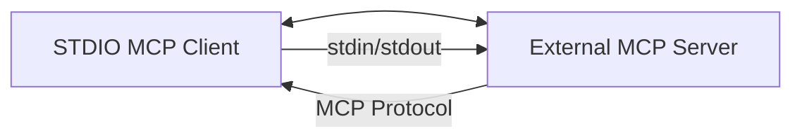

# STDIO Client Integration Example

A comprehensive example demonstrating how to use AIRS MCP as a STDIO-based client using the TransportClient architecture.

## Architecture Overview

This example shows how to build an MCP client that communicates via stdin/stdout (STDIO transport) with MCP servers. It demonstrates the **TransportClient interface** for clean client-side integrations.



## Features

- **TransportClient Architecture**: Clean client implementation using the new transport interface
- **STDIO Transport**: Communication via stdin/stdout for process-based integrations
- **Mock Server Support**: Built-in mock server for testing and development
- **Production Ready**: Proper error handling, logging, and configuration
- **Comprehensive Testing**: Automated test suite with various scenarios

## Quick Start

### 1. Running with Mock Server

```bash
# Start the client with mock server (for testing)
USE_MOCK=1 cargo run

# The client will:
# 1. Start an internal mock server
# 2. Connect via STDIO transport
# 3. Demonstrate basic MCP operations
# 4. Show proper cleanup and shutdown
```

### 2. Running with External Server

```bash
# Start an external MCP server first (example: stdio-server-integration)
cd ../stdio-server-integration
cargo run &

# Then start the client
cargo run

# The client will connect to the external server via STDIO
```

## Architecture Details

### TransportClient Implementation

This example demonstrates the **TransportClient interface**, which provides a clean separation between client logic and transport concerns:

```rust
use airs_mcp::transport::adapters::stdio::StdioTransportClientBuilder;
use airs_mcp::integration::McpClientBuilder;

// Clean client setup with TransportClient
let transport = StdioTransportClientBuilder::new()
    .command(&config.server_command)
    .timeout(config.request_timeout)
    .build()
    .await?;

let client = McpClientBuilder::new().build(transport);

// Simple initialization and usage
client.initialize().await?;
let tools = client.list_tools().await?;
```

### Key Components

- **`main.rs`**: Application entry point and orchestration
- **`client.rs`**: Core MCP client implementation using TransportClient
- **`config.rs`**: Configuration management for different scenarios

### Benefits Over Legacy Transport Trait

- **Cleaner API**: No server-oriented methods like `start()` and `close()`
- **Better Separation**: Client and server concerns are clearly separated
- **Simpler Testing**: Easier to mock and test client integrations
- **Future-Proof**: Designed for client-side usage patterns

## Testing

### Running the Test Suite

```bash
# Run all integration tests
cargo test

# Run with output
cargo test -- --nocapture

# Test specific scenarios
cargo test mock_server_integration
cargo test external_server_integration
```

### Test Coverage

The test suite covers:

- **Mock Server Integration**: Client working with built-in mock server
- **External Server Integration**: Client connecting to real MCP servers
- **Error Handling**: Network failures, invalid responses, timeouts
- **Protocol Compliance**: Proper MCP message formatting and responses
- **Resource Management**: Proper cleanup and connection management

## Configuration

### Environment Variables

- **`USE_MOCK=1`**: Use internal mock server for testing
- **`LOG_LEVEL=debug`**: Enable debug logging
- **`SERVER_TIMEOUT=30`**: Set server timeout in seconds

### Config File Support

```rust
// Example configuration
ClientConfig {
    server_command: vec!["../stdio-server-integration/target/debug/stdio-server-integration".to_string()],
    timeout_seconds: 30,
    use_mock: false,
}
```

## Development

### Building

```bash
# Development build
cargo build

# Release build
cargo build --release

# With all features
cargo build --all-features
```

### Debugging

Enable debug logging to see detailed transport communication:

```bash
RUST_LOG=debug cargo run
```

### Adding New Features

1. **Client Extensions**: Add new MCP operations in `client.rs`
2. **Transport Options**: Extend configuration in `config.rs`
3. **Testing**: Add tests for new functionality

## Integration with Other Examples

This client can connect to any of the server examples:

- **`stdio-server-integration`**: STDIO-based MCP server
- **`http-oauth2-server-integration`**: HTTP server (via adapter)
- **`http-apikey-server-integration`**: API key protected server (via adapter)

## Troubleshooting

### Common Issues

1. **Server Not Found**: Ensure the server binary exists and is executable
2. **Permission Errors**: Check file permissions on server binary
3. **Timeout Issues**: Increase timeout or check server responsiveness
4. **Protocol Errors**: Enable debug logging to see message details

### Debug Commands

```bash
# Check server binary
ls -la ../stdio-server-integration/target/debug/

# Test server directly
echo '{"jsonrpc":"2.0","id":1,"method":"initialize","params":{}}' | ../stdio-server-integration/target/debug/stdio-server-integration

# Run with full logging
RUST_LOG=trace cargo run
```

## Related Documentation

- **[TransportClient Architecture](../../src/transport/)**: Understanding the transport abstraction
- **[STDIO Server Integration](../stdio-server-integration/)**: Server-side STDIO implementation
- **[MCP Protocol Documentation](../../docs/)**: Protocol specifications and best practices

---

This example demonstrates modern MCP client patterns using the TransportClient architecture, providing a solid foundation for building STDIO-based MCP integrations.